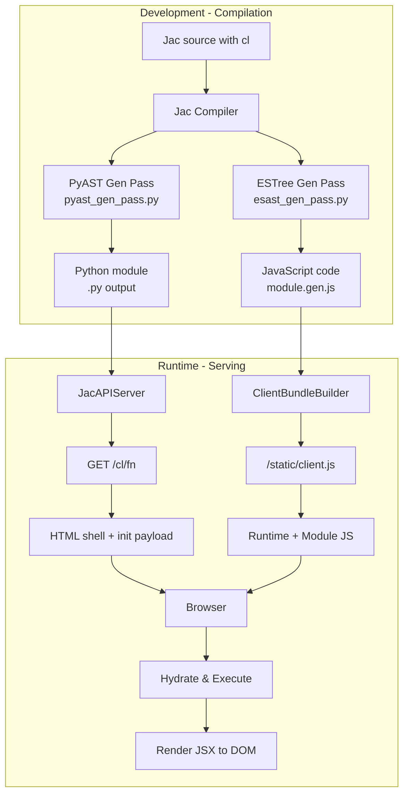

# JSX-Based Webpage Generation Design Document

## Overview

This document describes how Jac's `cl` (client) keyword produces browser-ready web experiences. Client-marked declarations compile to JavaScript and ship through `jac start` as static bundles that execute entirely in the browser. The current implementation is **CSR-only** (Client-Side Rendering): the server returns an empty HTML shell with bootstrapping metadata and a JavaScript bundle that handles all rendering in the browser.

**Key Features:**

- **JSX Support**: Full JSX syntax for declarative UI components
- **Reactive State Management**: Signal-based reactivity with automatic dependency tracking (no virtual DOM)
- **Client-Side Routing**: Hash-based routing with declarative route configuration
- **Server Integration**: Seamless walker spawning and function calls from client code
- **Authentication**: Built-in auth helpers with token-based authentication

## Architecture Overview



### CSR Execution Flow

1. **Compilation**: When a `.jac` file is compiled:
   - The `cl` keyword marks declarations for client-side execution
   - `pyast_gen_pass.py` skips Python codegen for client-only nodes (via `_should_skip_client`)
   - `esast_gen_pass.py` generates ECMAScript AST and JavaScript code
   - Client metadata is collected in `ClientManifest` (exports, globals, params)

2. **Bundle Generation**: `ClientBundleBuilder` creates the browser bundle:
   - Compiles [client_runtime.cl.jac](https://github.com/Jaseci-Labs/jaseci/blob/main/jac/jaclang/runtimelib/client_runtime.cl.jac) to provide JSX and walker runtime
   - Compiles the application module's client-marked code
   - Generates registration code that exposes functions globally
   - Includes polyfills (e.g., `Object.prototype.get()` for dict-like access)

3. **Page Request**: When `GET /cl/<function_name>` is requested:
   - Server returns minimal HTML with empty `<div id="__jac_root"></div>`
   - Embeds `<script id="__jac_init__">` with JSON payload containing:
     - Module name and function name to execute
     - Arguments and their ordering
     - Global variable values
   - Links to `<script src="/static/client.js?hash=...">` bundle

4. **Client Execution**: On DOM load, the browser:
   - Parses the `__jac_init__` payload
   - Looks up the requested function from the global registry
   - Restores client global variables
   - Executes the function with provided arguments
   - Calls `renderJsxTree()` to render the returned JSX into `__jac_root`

> **Note**: SSR + hydration is not currently implemented. All rendering happens on the client.

## Language Features

### 1. The `cl` (Client) Keyword

The `cl` keyword marks Jac declarations for **client-side compilation**. This enables a single `.jac` file to contain both:

- **Server-side code** (compiled to Python via `pyast_gen_pass`)
- **Client-side code** (compiled to JavaScript via `esast_gen_pass`)

When `cl` is present:

- Node is marked with `is_client_decl = True`
- Python codegen is skipped for the declaration (via `_should_skip_client()` in [pyast_gen_pass.py:310-312](https://github.com/Jaseci-Labs/jaseci/blob/main/jac/jaclang/compiler/passes/main/pyast_gen_pass.py#L310-L312))
- JavaScript codegen generates ECMAScript AST (in [esast_gen_pass.py](https://github.com/Jaseci-Labs/jaseci/blob/main/jac/jaclang/compiler/passes/ecmascript/esast_gen_pass.py))
- The declaration is tracked in the module's `ClientManifest` (exports, globals, params, globals_values, imports)

#### Supported Constructs

```jac
// Client function - executes in browser, can return JSX
cl def homepage() -> dict {
    return <div>
        <h1>Welcome</h1>
        <button onclick={load_feed()}>Load Feed</button>
    </div>;
}

// Client object - available on both client and server
cl obj ButtonProps {
    has label: str = "Hello";
    has count: int = 0;
}

// Client global - literal value sent to browser
cl API_BASE_URL: str = "https://api.example.com";
```

#### Grammar Definition

From [jac.lark:9-10, 591](https://github.com/Jaseci-Labs/jaseci/blob/main/jac/jaclang/compiler/jac.lark#L9-L10):

```lark
toplevel_stmt: KW_CLIENT? onelang_stmt
       | KW_CLIENT LBRACE onelang_stmt* RBRACE
       | py_code_block

KW_CLIENT: "cl"
```

The `cl` keyword can prefix individual statements or wrap multiple statements in braces.

### 2. Client Imports

Client code can import functions and utilities from the built-in `jac:client_runtime` module using the `cl import` syntax. This allows client-side code to access the runtime's JSX rendering, authentication helpers, and server interaction functions.

#### Syntax

```jac
cl import from jac:client_runtime {
    renderJsxTree,
    jacLogin,
    jacLogout,
    jacSignup,
    jacIsLoggedIn,
}
```

#### Available Exports from `jac:client_runtime`

The client runtime ([client_runtime.cl.jac](https://github.com/Jaseci-Labs/jaseci/blob/main/jac/jaclang/runtimelib/client_runtime.cl.jac)) exports these public functions for use in client code:

| Function | Signature | Description |
|----------|-----------|-------------|
| **JSX Rendering** | | |
| `renderJsxTree` | `(node: any, container: any) -> None` | Renders a JSX tree into a DOM container |
| **Reactive State Management** | | |
| `createSignal` | `(initialValue: any) -> list` | Creates a reactive signal (primitive value). Returns `[getter, setter]` |
| `createState` | `(initialState: dict) -> list` | Creates a reactive state (object). Returns `[getter, setter]` with shallow merge |
| `createEffect` | `(effectFn: any) -> None` | Runs a side effect function that re-executes when its dependencies change |
| **Client-Side Routing** | | |
| `createRouter` | `(routes: list, defaultRoute: str = "/") -> dict` | Creates a router instance with reactive path tracking |
| `Route` | `(path: str, component: any, guard: any = None) -> dict` | Creates a route configuration object |
| `Link` | `(props: dict) -> any` | Renders a navigation link component |
| `navigate` | `(path: str) -> None` | Programmatically navigates to a path |
| `useRouter` | `() -> dict` | Returns the current router instance |
| **Authentication** | | |
| `jacSignup` | `async (username: str, password: str) -> dict` | Creates a new user account and returns `{success, token, username}` or `{success, error}` |
| `jacLogin` | `async (username: str, password: str) -> bool` | Authenticates user and stores token in localStorage |
| `jacLogout` | `() -> None` | Clears authentication token from localStorage |
| `jacIsLoggedIn` | `() -> bool` | Checks if user has valid token in localStorage |

> **Note**: Functions prefixed with `__jac` (like `__jacJsx`, `__buildDom`, `__jacSpawn`, etc.) are internal runtime functions automatically available in the client bundle. They should not be imported directly - use the public API functions listed above instead.

#### How Client Imports Work

When processing client imports ([esast_gen_pass.py:317-325](https://github.com/Jaseci-Labs/jaseci/blob/main/jac/jaclang/compiler/passes/ecmascript/esast_gen_pass.py#L317-L325)):

1. **Parser detects** `cl import from jac:client_runtime` syntax
   - The `jac:` prefix indicates a special runtime import
   - The import is marked with `is_client_decl = True`

2. **ESTree generation** creates JavaScript import declaration:

   ```javascript
   import { renderJsxTree, jacLogin } from "jac:client_runtime";
   ```

3. **Manifest tracking** records the import in `ClientManifest.imports`:
   - Key: `"client_runtime"` (from `dot_path_str`)
   - Value: Resolved path to `client_runtime.cl.jac`

4. **Bundle generation** compiles `client_runtime.cl.jac` into the bundle, making these functions available globally

#### Example Usage

```jac
cl import from jac:client_runtime {
    jacLogin,
    jacLogout,
    jacIsLoggedIn,
}

cl def LoginForm() {
    async def handleLogin(event: any) {
        event.preventDefault();
        username = document.getElementById("username").value;
        password = document.getElementById("password").value;

        success = await jacLogin(username, password);
        if success {
            console.log("Login successful!");
            // Redirect or update UI
        } else {
            console.log("Login failed");
        }
    }

    return <form onsubmit={handleLogin}>
        <input id="username" type="text" placeholder="Username" />
        <input id="password" type="password" placeholder="Password" />
        <button type="submit">Login</button>
    </form>;
}
```

### 3. JSX Syntax

JSX is fully supported in Jac with grammar defined in [jac.lark:448-473](https://github.com/Jaseci-Labs/jaseci/blob/main/jac/jaclang/compiler/jac.lark#L448-L473). JSX elements are transpiled to `__jacJsx(tag, props, children)` calls by [jsx_processor.py:30-129](https://github.com/Jaseci-Labs/jaseci/blob/main/jac/jaclang/compiler/passes/ast_gen/jsx_processor.py#L30-L129) via the `EsJsxProcessor` class.

#### JSX Features

```jac
cl def render_example() {
    // Basic elements
    basic = <div>Hello World</div>;

    // Elements with attributes
    with_attrs = <button id="submit" class="btn">Click</button>;

    // Expression attributes and children
    name = "Alice";
    greeting = <h1 data-user={name}>Welcome, {name}!</h1>;

    // Spread attributes
    props = {"class": "card", "id": "main"};
    with_spread = <div {...props}>Content</div>;

    // Fragment syntax
    fragment = <>
        <div>First</div>
        <div>Second</div>
    </>;

    // Component usage (capitalized names)
    component = <Button label="Click Me" />;

    return <div>{greeting}{component}</div>;
}
```

#### JSX Transpilation

JSX elements compile to function calls:

- `<div>Hello</div>` → `__jacJsx("div", {}, ["Hello"])`
- `<Button {...props} />` → `__jacJsx(Button, Object.assign({}, props), [])`
- Tag names starting with lowercase become string literals
- Tag names starting with uppercase become identifier references
- Props merge via `Object.assign()` when spreads are present

### 4. Reactive State Management

Jac includes a built-in reactive state management system inspired by modern frameworks like SolidJS and Vue. The system provides automatic dependency tracking and efficient re-rendering without virtual DOM diffing.

#### Core Concepts

The reactive system is based on **signals** - reactive containers for values that automatically track their dependencies and notify subscribers when values change.

**Global Reactive Context** ([client_runtime.cl.jac:79-87](https://github.com/Jaseci-Labs/jaseci/blob/main/jac/jaclang/runtimelib/client_runtime.cl.jac#L79-L87)):

```javascript
__jacReactiveContext = {
    signals: [],              // Global signal storage
    pendingRenders: [],       // Batched re-renders queue
    flushScheduled: false,    // Debounce flag for batching
    rootComponent: null,      // Root function to re-render
    currentComponent: null,   // Current component ID being rendered
    currentEffect: null,      // Current effect for dependency tracking
    router: null              // Global router instance
}
```

#### createSignal - Reactive Primitives

Creates a reactive signal for primitive values. Returns a `[getter, setter]` tuple.

**Syntax** ([client_runtime.cl.jac:92-110](https://github.com/Jaseci-Labs/jaseci/blob/main/jac/jaclang/runtimelib/client_runtime.cl.jac#L92-L110)):

```jac
cl import from jac:client_runtime { createSignal }

cl def Counter() {
    [count, setCount] = createSignal(0);

    def increment() {
        setCount(count() + 1);  // Read with (), set by calling setter
    }

    return <div>
        <p>Count: {count()}</p>
        <button onclick={increment}>Increment</button>
    </div>;
}
```

**How it works:**

1. Each signal stores its value and a list of subscribers
2. When `count()` is called (getter), it automatically tracks which component/effect is reading it
3. When `setCount(newValue)` is called, it notifies all subscribers
4. Components are automatically re-rendered when their dependencies change
5. Re-renders are batched using `requestAnimationFrame` for efficiency

#### createState - Reactive Objects

Creates a reactive state object with shallow merge semantics. Ideal for managing component state with multiple properties.

**Syntax** ([client_runtime.cl.jac:114-139](https://github.com/Jaseci-Labs/jaseci/blob/main/jac/jaclang/runtimelib/client_runtime.cl.jac#L114-L139)):

```jac
cl import from jac:client_runtime { createState }

cl def TodoList() {
    [state, setState] = createState({
        "todos": [],
        "filter": "all"
    });

    def addTodo(text: str) {
        todos = state().todos;
        todos.push({"text": text, "done": False});
        setState({"todos": todos});  // Shallow merge with existing state
    }

    return <div>
        <ul>
            {[<li>{todo.text}</li> for todo in state().todos]}
        </ul>
    </div>;
}
```

**Difference from createSignal:**

- `setState(updates)` performs shallow merge: `newState = {...oldState, ...updates}`
- Useful for managing multiple related properties
- Still tracks dependencies automatically

#### createEffect - Side Effects

Runs a function whenever its reactive dependencies change. Automatically re-executes when any accessed signal/state updates.

**Syntax** ([client_runtime.cl.jac:143-174](https://github.com/Jaseci-Labs/jaseci/blob/main/jac/jaclang/runtimelib/client_runtime.cl.jac#L143-L174)):

```jac
cl import from jac:client_runtime { createSignal, createEffect }

cl def DataFetcher() {
    [userId, setUserId] = createSignal(1);
    [userData, setUserData] = createSignal(None);

    createEffect(lambda -> None {
        id = userId();  // Track dependency!
        console.log("Fetching user", id);
        # In real app, would fetch from API
        setUserData({"id": id, "name": "User " + str(id)});
    });

    return <div>
        <button onclick={lambda: setUserId(userId() + 1)}>Next User</button>
        <p>Current: {userData() and userData().name or "Loading..."}</p>
    </div>;
}
```

**How it works:**

1. Effect function executes immediately on creation
2. Any signals/state accessed during execution are automatically tracked
3. When tracked dependencies change, effect re-runs
4. No need to manually specify dependency arrays (unlike React's useEffect)

#### Automatic Re-rendering

Components that use signals are automatically re-rendered when dependencies change:

1. **Initial render**: Component executes, tracking which signals it reads
2. **Dependency tracking**: Each `getter()` call registers the current component as a subscriber
3. **Change notification**: When `setter(newValue)` is called, all subscribers are notified
4. **Batched updates**: Re-renders are queued and flushed on next `requestAnimationFrame`
5. **Re-execution**: Component function re-runs, generating new JSX
6. **DOM update**: New JSX is rendered to replace old content

### 5. Client-Side Routing

Jac includes a declarative routing system built on reactive signals. Routes are defined as configuration objects, and navigation automatically triggers re-renders.

#### createRouter - Router Setup

Creates a router instance with reactive path tracking using URL hash.

**Syntax** ([client_runtime.cl.jac:283-345](https://github.com/Jaseci-Labs/jaseci/blob/main/jac/jaclang/runtimelib/client_runtime.cl.jac#L283-L345)):

```jac
cl import from jac:client_runtime { createRouter, Route }

cl def App() {
    routes = [
        Route("/", HomePage),
        Route("/about", AboutPage),
        Route("/profile", ProfilePage, guard=jacIsLoggedIn)
    ];

    router = createRouter(routes, defaultRoute="/");

    return <div>
        <nav>
            <Link href="/">Home</Link>
            <Link href="/about">About</Link>
            <Link href="/profile">Profile</Link>
        </nav>
        <main>{router.render()}</main>
    </div>;
}
```

**Router API:**

- `router.path()` - Getter for current path (reactive)
- `router.render()` - Renders component for current route
- `router.navigate(path)` - Programmatically navigate to path

#### Route Configuration

The `Route` function creates route configuration objects ([client_runtime.cl.jac:348-350](https://github.com/Jaseci-Labs/jaseci/blob/main/jac/jaclang/runtimelib/client_runtime.cl.jac#L348-L350)):

```jac
Route(path, component, guard=None)
```

- `path` - URL path to match (e.g., `"/"`, `"/profile"`)
- `component` - Function that returns JSX to render
- `guard` - Optional function that returns bool; if false, route is blocked

#### Link Component

Renders navigation links that update the router without full page reload ([client_runtime.cl.jac:353-365](https://github.com/Jaseci-Labs/jaseci/blob/main/jac/jaclang/runtimelib/client_runtime.cl.jac#L353-L365)):

```jac
<Link href="/about">About Page</Link>

# Equivalent to:
<a href="#/about" onclick={handleClick}>About Page</a>
```

**Features:**

- Automatically prefixes href with `#` for hash routing
- Prevents default link behavior
- Calls `navigate()` to update router state
- Spreads additional props to `<a>` element

#### Programmatic Navigation

Use `navigate()` to change routes from code ([client_runtime.cl.jac:368-378](https://github.com/Jaseci-Labs/jaseci/blob/main/jac/jaclang/runtimelib/client_runtime.cl.jac#L368-L378)):

```jac
cl import from jac:client_runtime { navigate }

cl def LoginForm() {
    def handleSubmit() {
        # After successful login
        navigate("/dashboard");
    }

    return <form onsubmit={handleSubmit}>...</form>;
}
```

#### Route Guards

Protect routes with guard functions:

```jac
cl import from jac:client_runtime { Route, jacIsLoggedIn, navigate }

cl def AccessDenied() {
    return <div>
        <h1>Access Denied</h1>
        <button onclick={lambda: navigate("/login")}>Login</button>
    </div>;
}

Route("/admin", AdminPanel, guard=jacIsLoggedIn)
```

If guard returns `False`, the route renders `AccessDenied` component instead.

#### How Routing Works

1. **Hash-based routing**: Uses `window.location.hash` (e.g., `#/profile`)
2. **Reactive path**: Current path is stored in a signal
3. **Event listeners**: `hashchange` and `popstate` events update the signal
4. **Automatic re-render**: Changing the path signal triggers router re-render
5. **Component lookup**: Router finds matching route and renders its component

**No manual routing updates needed** - the reactive system handles everything!

## Implementation Details

### Core Components

| Component | Implementation | Key Responsibilities |
|-----------|----------------|---------------------|
| **Compiler Passes** | | |
| [pyast_gen_pass.py](https://github.com/Jaseci-Labs/jaseci/blob/main/jac/jaclang/compiler/passes/main/pyast_gen_pass.py) | Python AST generation | Skips Python codegen for `cl`-marked nodes |
| [esast_gen_pass.py](https://github.com/Jaseci-Labs/jaseci/blob/main/jac/jaclang/compiler/passes/ecmascript/esast_gen_pass.py) | ECMAScript AST generation | Generates JavaScript for `cl`-marked nodes, JSX transpilation |
| [es_unparse.py](https://github.com/Jaseci-Labs/jaseci/blob/main/jac/jaclang/compiler/passes/ecmascript/es_unparse.py) | JavaScript code generation | Converts ESTree AST to JavaScript source |
| **Runtime Components** | | |
| [client_bundle.py](https://github.com/Jaseci-Labs/jaseci/blob/main/jac/jaclang/runtimelib/client_bundle.py) | Bundle builder | Compiles runtime + module, generates registration code |
| [client_runtime.cl.jac](https://github.com/Jaseci-Labs/jaseci/blob/main/jac/jaclang/runtimelib/client_runtime.cl.jac) | Client runtime | JSX rendering (`__jacJsx`, `renderJsxTree`), walker spawning (`__jacSpawn`), auth helpers |
| [server.py](https://github.com/Jaseci-Labs/jaseci/blob/main/jac/jaclang/runtimelib/server.py) | HTTP server | Serves pages (`/cl/<fn>`), bundles (`/static/client.js`), walkers |
| **Data Structures** | | |
| [ClientManifest](https://github.com/Jaseci-Labs/jaseci/blob/main/jac/jaclang/compiler/codeinfo.py#L15-L25) | Metadata container (in codeinfo.py) | Stores `exports` (function names), `globals` (var names), `params` (arg order), `globals_values` (literal values), `has_client` (bool), `imports` (module mappings) |

### Client Bundle Structure

The bundle generated by `ClientBundleBuilder` contains (in order):

1. **Polyfills** - Browser compatibility shims (from [client_runtime.cl.jac:227-253](https://github.com/Jaseci-Labs/jaseci/blob/main/jac/jaclang/runtimelib/client_runtime.cl.jac#L227-L253)):
   The `__jacEnsureObjectGetPolyfill()` function adds a Python-style `.get()` method to `Object.prototype`:

   ```javascript
   Object.prototype.get = function(key, defaultValue) {
       if (this.hasOwnProperty(key)) {
           return this[key];
       }
       return defaultValue !== undefined ? defaultValue : null;
   };
   ```

   This polyfill is called automatically during module registration and hydration.

2. **Client Runtime** - Compiled from [client_runtime.cl.jac](https://github.com/Jaseci-Labs/jaseci/blob/main/jac/jaclang/runtimelib/client_runtime.cl.jac):
   - **JSX Rendering**: `__jacJsx(tag, props, children)`, `renderJsxTree(node, container)`, `__buildDom(node)`, `__applyProp(element, key, value)`
   - **Reactive System**: `createSignal(initialValue)`, `createState(initialState)`, `createEffect(effectFn)`, `__jacTrackDependency()`, `__jacNotifySubscribers()`
   - **Router System**: `createRouter(routes, defaultRoute)`, `Route(path, component, guard)`, `Link(props)`, `navigate(path)`, `useRouter()`
   - **Server Communication**: `__jacSpawn(walker, fields)` - Async walker invocation via `/walker/<name>` endpoint, `__jacCallFunction(function_name, args)` - Async server-side function calls via `/function/<name>` endpoint
   - **Authentication**: `jacSignup`, `jacLogin`, `jacLogout`, `jacIsLoggedIn`
   - **Hydration System**: `__jacRegisterClientModule`, `__jacHydrateFromDom`, `__jacEnsureHydration`

3. **Application Module** - Transpiled user code with `cl` declarations

4. **Registration Code** - Generated by [client_bundle.py:245-251](https://github.com/Jaseci-Labs/jaseci/blob/main/jac/jaclang/runtimelib/client_bundle.py#L245-L251):

   ```javascript
   __jacRegisterClientModule("module_name", ["homepage", "other_func"], {"API_URL": "value"});
   ```

   This calls the `__jacRegisterClientModule` function from the runtime which:
   - Registers all exported client functions in the global registry
   - Sets up client global variables with default values
   - Creates a module record in `__jacClient.modules`
   - Calls `__jacEnsureHydration` to set up DOMContentLoaded listener
   - Executes hydration automatically when DOM is ready

### Server Endpoints

From [server.py](https://github.com/Jaseci-Labs/jaseci/blob/main/jac/jaclang/runtimelib/server.py):

| Endpoint | Method | Description | Implementation |
|----------|--------|-------------|----------------|
| `/cl/<fn>` | GET | Render HTML page for client function | Lines 806-830 |
| `/static/client.js` | GET | Serve compiled JavaScript bundle | Lines 772-781 |
| `/walker/<name>` | POST | Spawn walker on node | Handled by ExecutionHandler |
| `/function/<name>` | POST | Call server-side function | Handled by ExecutionHandler |
| `/user/create` | POST | Create new user account | Handled by AuthHandler |
| `/user/login` | POST | Authenticate and get token | Handled by AuthHandler |
| `/functions` | GET | List available functions | Handled by IntrospectionHandler |
| `/walkers` | GET | List available walkers | Handled by IntrospectionHandler |

> **Note**: The server has been refactored to use handler classes (AuthHandler, IntrospectionHandler, ExecutionHandler) for better organization.

#### Page Rendering Flow

When `GET /cl/homepage?arg1=value1` is requested:

1. **Parse request** - Extract function name and query params
2. **Authenticate** - Check auth token, or create guest user
3. **Load module** - Ensure module is loaded and manifest is available
4. **Validate function** - Check function is in `client_exports`
5. **Build payload** - Serialize args, globals, arg order
6. **Render HTML** - Return shell with embedded payload and script tag

HTML template (from [server.py:491-504](https://github.com/Jaseci-Labs/jaseci/blob/main/jac/jaclang/runtimelib/server.py#L491-L504)):

```html
<!DOCTYPE html>
<html lang="en">
<head>
    <meta charset="utf-8"/>
    <title>homepage</title>
</head>
<body>
    <div id="__jac_root"></div>
    <script id="__jac_init__" type="application/json">
        {"module":"myapp","function":"homepage","args":{},"globals":{},"argOrder":[]}
    </script>
    <script type="module" src="/static/client.js?hash=abc123..."></script>
</body>
</html>
```

**Note**: The JSON in `__jac_init__` has `</` escaped as `<\/` to prevent script injection attacks.

### Client-Side Execution

On page load in the browser ([client_runtime.cl.jac:726-821](https://github.com/Jaseci-Labs/jaseci/blob/main/jac/jaclang/runtimelib/client_runtime.cl.jac#L726-L821)):

1. **Wait for DOM** - `__jacEnsureHydration()` waits for `DOMContentLoaded`
2. **Parse payload** - `__jacHydrateFromDom()` extracts `__jac_init__` JSON from script tag
3. **Validate hydration** - Check if already hydrated (prevent duplicate execution)
4. **Restore globals** - Set global variables from `payload.globals`
5. **Lookup function** - Find target function in module's registered functions
6. **Order arguments** - Map args dict to positional array using `argOrder`
7. **Setup reactive root** - Create root component wrapper for reactive re-rendering
8. **Execute function** - Call function with ordered arguments
9. **Handle result** - If Promise, await; otherwise render immediately
10. **Render JSX** - Call `renderJsxTree(result, __jac_root)` with batched updates

**Key Implementation Details:**

```jac
# Set up reactive root component for automatic re-rendering
__jacReactiveContext.rootComponent = lambda -> any {
    __jacReactiveContext.currentComponent = "__root__";
    result = target(...orderedArgs);  # Execute with dependency tracking
    return result;
};

# Execute and render
callOutcome = __jacSafeCallTarget(target, scope, orderedArgs, targetName);
value = callOutcome.get("value");

if value and __isObject(value) and __isFunction(value.then) {
    # Async result - wait for promise
    value.then(lambda node: __jacApplyRender(renderer, rootEl, node));
} else {
    # Sync result - render immediately
    __jacApplyRender(renderer, rootEl, value);
}
```

**Hydration Safety:** The system marks the `__jac_init__` element with `data-jac-hydrated="true"` to prevent duplicate hydration if scripts execute multiple times.

### JSX Rendering

The `renderJsxTree` function ([client_runtime.cl.jac:8-10](https://github.com/Jaseci-Labs/jaseci/blob/main/jac/jaclang/runtimelib/client_runtime.cl.jac#L8-L10)) calls `__buildDom` ([client_runtime.cl.jac:13-54](https://github.com/Jaseci-Labs/jaseci/blob/main/jac/jaclang/runtimelib/client_runtime.cl.jac#L13-L54)) to recursively build DOM:

1. **Null/undefined** → Empty text node (`document.createTextNode("")`)
2. **Primitive values** → Text node with `String(value)`
3. **Object with callable `tag`** → Execute component function with props (including children), recurse on result
4. **Object with string `tag`** → Create element:
   - Create element with `document.createElement(tag)`
   - Apply props (attributes, event listeners, styles) via `__applyProp`
   - Recursively build and append children
5. **Return DOM node** → Attach to container via `container.replaceChildren(domNode)`

Event handlers are bound in `__applyProp` ([client_runtime.cl.jac:57-72](https://github.com/Jaseci-Labs/jaseci/blob/main/jac/jaclang/runtimelib/client_runtime.cl.jac#L57-L72)):

- Props starting with `on` (e.g., `onclick`, `onsubmit`) become `addEventListener(eventName, handler)`
  - Event name is extracted by removing `on` prefix and converting to lowercase
- `class` and `className` both set `element.className`
- `style` objects are applied to `element.style[key]` for each key
- Other props (except `children`) are set via `element.setAttribute(key, String(value))`

## Example Usage

### Complete Application

```jac
// Server-side data model
node User {
    has name: str;
    has email: str;
}

// Client-side global configuration
cl API_URL: str = "/api";

// Client-side component
cl obj CardProps {
    has title: str = "Untitled";
    has content: str = "";
}

// Client page - renders in browser
cl def homepage() {
    return <div class="app">
        <header>
            <h1>Welcome to Jac</h1>
        </header>
        <main>
            <p>Full-stack web development in one language!</p>
            <button onclick={load_users()}>Load Users</button>
        </main>
    </div>;
}

// Server-side walker - called from client via spawn
walker LoadUsers {
    has users: list = [];

    can process with Root entry {
        # Fetch users from database
        self.users = [{"name": "Alice"}, {"name": "Bob"}];
        report self.users;
    }
}
```

### Running the Application

```bash
# Compile the Jac file
jac myapp.jac

# Start the server
jac start myapp.jac

# Access the page
# Browser: http://localhost:8000/cl/homepage
```

### Client-Server Interaction

When the user clicks "Load Users":

1. **Client**: `spawn load_users()` triggers `__jacSpawn("LoadUsers", {})`
2. **HTTP**: Async `POST /walker/LoadUsers` with `{"nd": "root"}` and Authorization header
3. **Server**: Authenticates user, spawns `LoadUsers` walker on root node
4. **Server**: Walker executes, generates reports
5. **HTTP**: Returns `{"result": {...}, "reports": [...]}`
6. **Client**: Receives walker results as Promise (can be awaited to update UI)

The `__jacSpawn` function is async and retrieves the auth token from localStorage before making the request.

### Reactive Application Example

Here's a complete example using signals, state, and routing:

```jac
cl import from jac:client_runtime {
    createSignal,
    createState,
    createRouter,
    Route,
    Link,
    navigate,
}

// Counter component with reactive signal
cl def Counter() {
    [count, setCount] = createSignal(0);

    return <div>
        <h2>Counter: {count()}</h2>
        <button onclick={lambda: setCount(count() + 1)}>+</button>
        <button onclick={lambda: setCount(count() - 1)}>-</button>
    </div>;
}

// Todo list with reactive state
cl def TodoApp() {
    [state, setState] = createState({
        "todos": [],
        "input": ""
    });

    def addTodo() {
        todos = state().todos;
        todos.push({"text": state().input, "done": False});
        setState({"todos": todos, "input": ""});
    }

    return <div>
        <h2>Todos</h2>
        <input
            value={state().input}
            oninput={lambda e: setState({"input": e.target.value})}
        />
        <button onclick={addTodo}>Add</button>
        <ul>
            {[<li>{todo.text}</li> for todo in state().todos]}
        </ul>
    </div>;
}

// Main app with routing
cl def littlex_app() {
    routes = [
        Route("/", Counter),
        Route("/todos", TodoApp)
    ];

    router = createRouter(routes, "/");

    return <div>
        <nav>
            <Link href="/">Counter</Link>
            <Link href="/todos">Todos</Link>
        </nav>
        <main>{router.render()}</main>
    </div>;
}
```

**Key Features Demonstrated:**

- Reactive signals (`createSignal`) for simple counters
- Reactive state (`createState`) for complex component state
- Client-side routing without page reloads
- Automatic re-rendering when state changes
- No manual DOM manipulation needed

## Test Coverage

| Test Suite | Location | Coverage |
|------------|----------|----------|
| **Client codegen tests** | [test_client_codegen.py](https://github.com/Jaseci-Labs/jaseci/blob/main/jac/jaclang/compiler/tests/test_client_codegen.py) | `cl` keyword detection, manifest generation |
| **ESTree generation tests** | [test_esast_gen_pass.py](https://github.com/Jaseci-Labs/jaseci/blob/main/jac/jaclang/compiler/passes/ecmascript/tests/test_esast_gen_pass.py) | JavaScript AST generation |
| **JavaScript generation tests** | [test_js_generation.py](https://github.com/Jaseci-Labs/jaseci/blob/main/jac/jaclang/compiler/passes/ecmascript/tests/test_js_generation.py) | JS code output from ESTree |
| **Client bundle tests** | [test_client_bundle.py](https://github.com/Jaseci-Labs/jaseci/blob/main/jac/jaclang/runtimelib/tests/test_client_bundle.py) | Bundle building, caching, import resolution |
| **Server endpoint tests** | [test_serve.py](https://github.com/Jaseci-Labs/jaseci/blob/main/jac/jaclang/runtimelib/tests/test_serve.py) | HTTP endpoints, page rendering |
| **JSX rendering tests** | [test_jsx_render.py](https://github.com/Jaseci-Labs/jaseci/blob/main/jac/jaclang/runtimelib/tests/test_jsx_render.py) | JSX parsing and rendering |
| **Reactive signals tests** | [test_reactive_signals.py](https://github.com/Jaseci-Labs/jaseci/blob/main/jac/jaclang/runtimelib/tests/test_reactive_signals.py) | Signal creation, effects, dependency tracking |
| **Router tests** | [test_router.py](https://github.com/Jaseci-Labs/jaseci/blob/main/jac/jaclang/runtimelib/tests/test_router.py) | Routing, navigation, route guards |
| **Closures tests** | [test_closures.py](https://github.com/Jaseci-Labs/jaseci/blob/main/jac/jaclang/runtimelib/tests/test_closures.py) | Nested functions, closure semantics in JavaScript |

### Example Test Fixtures

- [client_jsx.jac](https://github.com/Jaseci-Labs/jaseci/blob/main/jac/jaclang/compiler/passes/ecmascript/tests/fixtures/client_jsx.jac) - Comprehensive client syntax examples
- [jsx_elements.jac](https://github.com/Jaseci-Labs/jaseci/blob/main/jac/examples/reference/jsx_elements.jac) - JSX feature demonstrations
- [test_reactive_signals.jac](https://github.com/Jaseci-Labs/jaseci/blob/main/jac/jaclang/runtimelib/tests/fixtures/test_reactive_signals.jac) - Reactive signals and effects examples
- [test_router.jac](https://github.com/Jaseci-Labs/jaseci/blob/main/jac/jaclang/runtimelib/tests/fixtures/test_router.jac) - Routing and navigation examples
- [littleX_single_nodeps.jac](https://github.com/Jaseci-Labs/jaseci/blob/main/jac/examples/littleX/littleX_single_nodeps.jac) - Full SPA with reactive state and routing
