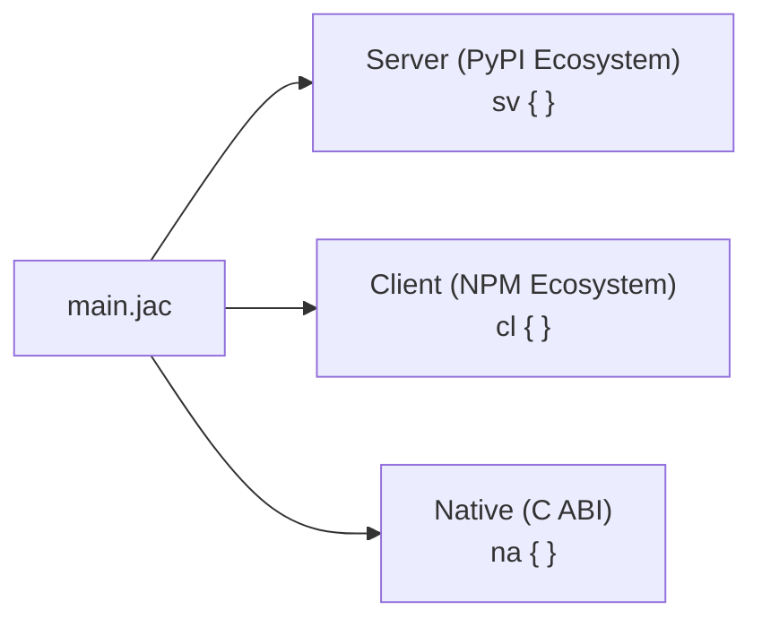
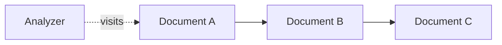
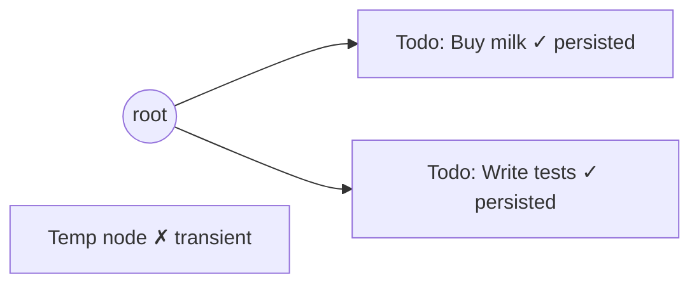

# Core Concepts

Most of Jac will be recognizable if you are familiar with another programming language like Python -- Jac supersets Python, so familiar constructs like functions, classes, imports, list comprehensions, and control flow all work as expected. You can explore those in depth in the [tutorials](../tutorials/index.md) and [language reference](../reference/language/index.md).

This page focuses on the three concepts that Jac adds beyond traditional programming languages. These are the ideas the rest of the documentation builds on, introduced briefly so you have the vocabulary for the tutorials that follow. Through these concepts three important questions can be answered:

1. [How can one language target frontend, backend, and native binaries at the same time?](#1-how-can-one-language-target-frontends-backends-and-native-binaries-at-the-same-time)
2. [How does Jac fully abstract away database organization and interactions and the complexity of multiuser persistent data?](#2-how-does-jac-fully-abstract-away-database-organization-and-interactions-and-the-complexity-of-multiuser-persistent-data)
3. [How does Jac abstract away the laborious task of prompt/context engineering for AI and turn it into a compiler/runtime problem?](#3-how-does-jac-abstract-away-the-laborious-task-of-promptcontext-engineering-for-ai-and-turn-it-into-a-compilerruntime-problem)

---

## 1. How can one language target frontends, backends, and native binaries at the same time?

Similar to namespaces, the Jac language introduces the concept of **codespaces**. A Jac program can contain code that runs in different environments. You denote the codespace either with a **block prefix** inside a file or with a **file extension**:



**Inline blocks** -- mix codespaces in a single file:

- `sv { }` -- code that runs on the server (compiles to Python)
- `cl { }` -- code that runs in the browser (compiles to JavaScript)
- `na { }` -- code that runs natively compiled on the host machine (compiles to native binary)
- Code outside any block defaults to the server codespace

**File extensions** -- set the default top-level codespace for a file, e.g., for a module `prog`:

- `prog.sv.jac` -- top-level code defaults to server
- `prog.cl.jac` -- top-level code defaults to client
- `prog.na.jac` -- top-level code defaults to native
- `prog.jac` -- defaults to the server codespace

Any `.jac` file can still use all codespace blocks regardless of its extension. The extension only changes what the default is for code outside any block.

Here's a file that uses two codespaces via inline blocks:

```jac
# Server codespace (default)
node Todo {
    has title: str, done: bool = False;
}

def:pub add_todo(title: str) -> dict {
    todo = root ++> Todo(title=title);
    return {"id": todo[0].id, "title": todo[0].title};
}

# Client codespace
cl {
    def:pub app -> JsxElement {
        has items: list = [];

        async def add -> None {
            todo = await add_todo("New");
            items = items.concat([todo]);
        }

        return <div>
            <button onClick={lambda -> None { add(); }}>
                Add
            </button>
        </div>;
    }
}
```

The server definitions are visible to the `cl` block. When the client calls `add_todo(...)`, the compiler generates the HTTP call, serialization, and routing between codespaces. You write one language; the compiler produces the interop layer.

Codespaces are similar to namespaces, but instead of organizing names, they organize where code executes. Interop between them -- function calls, spawn calls, type sharing -- is handled by the compiler and runtime.

---

## 2. How does Jac fully abstract away database organization and interactions and the complexity of multiuser persistent data?

Jac introduces graph-based Object Spatial Programming (OSP) constructs. OSP gives us two key capabilities. It provides us with a natural way to articulate solutions to problems with graph-like and hierarchical properties, and importantly, a way to organize a programs interaction with data that allows us to hide the complexity of database organization and management.

Standard object-oriented programming models data as isolated objects -- you call methods to bring data to computation. OSP adds a layer on top: objects exist in a **graph** with explicit relationships. Additionally, the `walker` construct is also introduced allowing computation to **move to the data** by traversing that graph.

OSP introduces three constructs alongside standard objects:

```jac
# Nodes: objects that live in a graph
node Document { has content: str; }
node Summary  { has text: str; }

# Edges: typed relationships between nodes
edge Summarizes {}

# Walkers: computation that traverses the graph
walker Analyzer {
    has results: list = [];

    can process with Document entry {
        self.results.append(here.content);
        visit [-->];
    }
}
```

When you spawn an `Analyzer`, it visits each connected `Document` node and runs `process` at each one:



This model maps naturally to **agentic AI workflows**: the walker is the agent, the graph is the state space, and traversal is reasoning. States, transitions, tool calls, and memory are all nodes and edges.

### Persistence through `root`

Every Jac program has a built-in `root` node. Nodes reachable from `root` are **persistent** -- they survive process restarts. The runtime generates the storage schema from your node declarations automatically. This allows Jac to abstract away database organization moving that to the responsibility of the runtime.



You declare `node Todo { has title: str; }`, connect instances to `root`, and the runtime handles storage. Nodes not reachable from `root` are transient and will be garbage collected.

---

## 3. How does Jac abstract away the laborious task of prompt/context engineering for AI and turn it into a compiler/runtime problem?

Jac introduces Compiler-Integrated AI through its `by` and `sem` keywords. These  two keywords allow integrating language models into programs at the language level rather than through library calls.

### `by` -- delegate a function's implementation

```jac
enum Category { WORK, PERSONAL, SHOPPING, HEALTH, OTHER }

def categorize(title: str) -> Category
    by llm();
```

This function has no body. `by llm()` tells the compiler to delegate the implementation to a language model. The compiler extracts semantics from the code itself -- the function name, parameter names, types, and return type -- to construct the prompt. A well-named function like `categorize` with a typed parameter `title: str` and return type `Category` already communicates intent.

The return type is enforced. If the return type is an `enum`, the LLM can only produce one of its values. If it's an `obj`, every field must be filled. The type annotation serves as the output contract.

### `sem` -- attach semantics to bindings

The compiler can only infer so much from names and types. `sem` is the mechanism for providing additional semantic information beyond what exists in the code. It attaches a description to a specific variable binding that the compiler includes in the prompt:

```jac
obj Ingredient {
    has name: str;
    has cost: float;
    has carby: bool;
}

sem Ingredient.cost = "Estimated cost in USD";
sem Ingredient.carby = "True if this ingredient is high in carbohydrates";

def plan_shopping(recipe: str) -> list[Ingredient]
    by llm();
sem plan_shopping = "Generate a shopping list for the given recipe.";
```

Without `sem`, the LLM has only the names `cost` and `carby` to work with. With it, the compiler includes "Estimated cost in USD" and "True if this ingredient is high in carbohydrates" in the prompt, producing more accurate structured output. The `sem` on `plan_shopping` itself provides the function-level instruction.

`sem` is not a comment. It's a compiler directive that attaches semantic meaning to variable bindings -- fields, parameters, functions -- and changes what the LLM sees at runtime. It is the only way to convey intent beyond what the compiler can extract from the code and values in the program.

---

## How the Three Concepts Relate

1. **Codespaces** define where code runs -- server, client, or native
2. **OSP** defines how data is structured and traversed -- nodes, edges, walkers, and persistence through `root`
3. **`by` and `sem`** define how AI is integrated -- the compiler extracts semantics from code structure, and `sem` provides additional meaning where names and types aren't sufficient

In practice, these compose: walkers traverse a graph on the server, delegate decisions to an LLM via `by llm()`, and the results render in a client-side UI -- all within one language.

---

## Quick Reference

| Syntax | Meaning |
|--------|---------|
| `sv { }` | Server codespace |
| `cl { }` | Client codespace |
| `na { }` | Native codespace |
| `node X { has ...; }` | Declare a graph data type |
| `root` | Built-in starting node (persistence anchor) |
| `a ++> b` | Connect node `a` to node `b` |
| `[a -->]` | Get all nodes connected from `a` |
| `walker W { }` | Declare mobile computation |
| `visit [-->]` | Move walker to connected nodes |
| `by llm()` | Delegate function body to an LLM |
| `sem X.field = "..."` | Semantic hint for AI understanding |

---

## Next Steps

- [Jac vs Traditional Stack](jac-vs-traditional-stack.md) -- Side-by-side comparison with a traditional stack
- [Build Your First App](../tutorials/first-app/part1-todo-app.md) -- Apply these concepts in a working app
- [Object-Spatial Programming](../tutorials/language/osp.md) -- Full tutorial on nodes, edges, and walkers
- [byLLM Quickstart](../tutorials/ai/quickstart.md) -- Build an AI-integrated function
