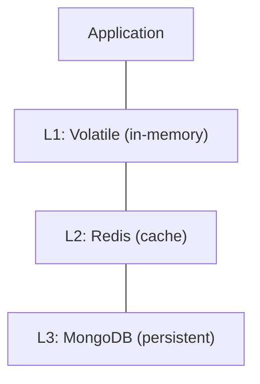

# Part IX: Deployment and Scaling

**In this part:**

- [jac-scale Plugin](#jac-scale-plugin) - Production deployment, APIs, persistence
- [Kubernetes Deployment](#kubernetes-deployment) - Helm charts, scaling
- [Production Architecture](#production-architecture) - Multi-tier, security, monitoring
- [Library Mode](#library-mode) - Pure Python deployment with Jac runtime

---

Jac applications can be deployed to production with the `jac-scale` plugin. It transforms your Jac code into a scalable backend with automatic API generation, database persistence, and Kubernetes orchestration. This "scale-native" approach means you develop locally and deploy to production without rewriting code.

## jac-scale Plugin

The `jac-scale` plugin is Jac's production deployment system. It wraps your code with FastAPI for HTTP handling, Redis for caching, and MongoDB for persistence. Walkers automatically become API endpoints, and graph state persists across requests.

### 1 Overview

jac-scale provides production-ready deployment with:

- FastAPI backend
- Redis caching
- MongoDB persistence
- Kubernetes orchestration

### 2 Installation

```bash
pip install jac-scale
jac plugins enable scale
```

### 3 Basic Deployment

```bash
# Development
jac start main.jac --port 8000

# Production with scaling
jac start --scale
```

### 4 Environment Configuration

| Variable | Description |
|----------|-------------|
| `REDIS_URL` | Redis connection URL |
| `MONGODB_URI` | MongoDB connection URI |
| `K8S_NAMESPACE` | Kubernetes namespace |
| `K8S_REPLICAS` | Number of replicas |

### 5 CORS Configuration

```toml
[plugins.scale.cors]
allow_origins = ["https://example.com"]
allow_methods = ["GET", "POST", "PUT", "DELETE"]
allow_headers = ["*"]
```

---

## Kubernetes Deployment

### 1 Auto-Scaling

```bash
jac start --scale
```

Automatically provisions:

- Deployment with specified replicas
- Service for load balancing
- ConfigMap for configuration
- StatefulSets for Redis/MongoDB

### 2 Generated Resources

```yaml
# Example generated deployment
apiVersion: apps/v1
kind: Deployment
metadata:
  name: jac-app
spec:
  replicas: 3
  selector:
    matchLabels:
      app: jac-app
```

### 3 Health Checks

Built-in endpoints:

- `/health` -- Liveness probe
- `/ready` -- Readiness probe

---

## Production Architecture

### 1 Multi-Layer Memory



### 2 FastAPI Integration

Public walkers become OpenAPI endpoints:

```bash
# Swagger docs available at
http://localhost:8000/docs
```

### 3 Service Discovery

Kubernetes service mesh integration for:

- Automatic load balancing
- Service-to-service communication
- Health monitoring

---

## Library Mode

For teams preferring pure Python syntax or integrating Jac into existing Python codebases, Library Mode provides an alternative deployment approach. Instead of `.jac` files, you use Python files with Jac's runtime as a library.

> **Complete Guide:** See [Library Mode](library-mode.md) for the full API reference, code examples, and migration guide.

**Key Features:**

- All Jac features accessible through `jaclang.lib` imports
- Pure Python syntax with decorators (`@on_entry`, `@on_exit`)
- Full IDE/tooling support (autocomplete, type checking, debugging)
- Zero migration friction for existing Python projects

**Quick Example:**

```python
from jaclang.lib import Node, Walker, spawn, root, on_entry

class Task(Node):
    title: str
    done: bool = False

class TaskFinder(Walker):
    @on_entry
    def find(self, here: Task) -> None:
        print(f"Found: {here.title}")

spawn(TaskFinder(), root())
```

---
