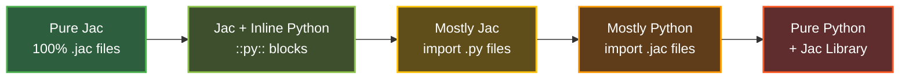

# Python Integration

> **Part of:** [Part VIII: Ecosystem](ecosystem.md)
>
> **Related:** [Library Mode](library-mode.md) | [Build a Todo App](../../tutorials/fullstack/todo-app.md)

---

## **Jac Supersets Python**

Jac supersets Python and JavaScript, providing full compatibility with both the PyPI and npm ecosystems. Developers can leverage their existing knowledge while accessing new capabilities for graph-based and object-spatial programming.

### **How it Works: Transpilation to Native Python**

Jac programs execute on the standard Python runtime without requiring custom runtime environments, virtual machines, or interpreters. The Jac compiler transpiles Jac source code into standard Python through a multi-stage compilation pipeline that generates optimized Python bytecode. This approach provides several advantages:

* **Standard Python Runtime:** Jac programs execute on the Python runtime, utilizing Python's garbage collector, memory management, and threading model.
* **Full Ecosystem Access:** All packages on PyPI, internal libraries, and Python development tools are compatible with Jac.
* **Readable Output:** The transpiled Python code is clean and maintainable, enabling inspection, debugging, and understanding.

The relationship between Jac and Python is analogous to that of TypeScript and JavaScript: a superset language that compiles to a widely-adopted base language.

**Example: From Jac to Python**

The following Jac module demonstrates functions, objects, and an entrypoint:

```jac
"""Functions in Jac."""

def factorial(n: int) -> int {
    if n == 0 { return 1; }
    else { return n * factorial(n-1); }
}

obj Person {
    has name: str;
    has age: int;

    def greet() -> None {
        print(f"Hello, my name is {self.name} and I'm {self.age} years old.");
    }
}

with entry {
    person = Person("John", 42);
    person.greet();
    print(f"5! = {factorial(5)}");
}
```

The Jac compiler converts this code into the following Python implementation:

```python
"""Functions in Jac."""
from __future__ import annotations
from jaclang.lib import Obj

def factorial(n: int) -> int:
    if n == 0:
        return 1
    else:
        return n * factorial(n - 1)

class Person(Obj):
    name: str
    age: int

    def greet(self) -> None:
        print(f"Hello, my name is {self.name} and I'm {self.age} years old.")

person = Person('John', 42)
person.greet()
print(f'5! = {factorial(5)}')
```

The compiled output demonstrates how Jac's object-oriented features map to standard Python classes inheriting from `Obj` (Jac's base object archetype), with imports from the `jaclang.lib` package.

---

### **Seamless Interoperability: Import Jac Files Like Python Modules**

Jac integrates with Python through a simple import mechanism. By adding `import jaclang` to Python code, developers can import `.jac` files using standard Python import statements without requiring build steps, compilation commands, or configuration files.

**Key Integration Features:**

* **Bidirectional Module Imports:** Python files can import Jac modules, and Jac files can import Python modules using standard import syntax. Modules written in `.jac` and `.py` can be used interchangeably within a project.

* **Incremental Adoption:** Jac can be added to existing Python projects without restructuring the codebase. Python files can remain unchanged while Jac modules are introduced where beneficial.

* **Standard Import Syntax:** The same `import` statements used for Python modules work with `.jac` files, requiring no special syntax or additional tools.

**Example: Importing Across Languages**

Consider a Jac module containing graph utilities:

```jac
# graph_tools.jac
node Task {
    has name: str;
    has priority: int;
}
```

This module can be imported in Python using standard import syntax:

```python
# main.py
import jaclang  # Enable Jac imports (one-time setup)
from graph_tools import Task  # Import from .jac file

# Use Jac classes in Python
my_task = Task(name="Deploy", priority=1)
```

Jac files can also import Python libraries:

```jac
# analyzer.jac
import pandas as pd;
import numpy as np;

# Use Python libraries in Jac code
```

**Implementation Details:** Jac extends Python's native import mechanism using the [PEP 302](https://peps.python.org/pep-0302/) import hook system. When `import jaclang` is executed, it registers a custom importer that enables Python to locate and load `.jac` files. Subsequently, Python's import mechanism automatically checks for `.jac` files alongside `.py` files, compiles them transparently, and loads them into the program. This integration makes Jac modules function as first-class citizens within the Python environment.

---

### **Five Adoption Patterns: Choose Your Integration Level**

Jac provides five adoption strategies that accommodate different development requirements, ranging from pure Python implementations with Jac library support to fully Jac-based applications. The following patterns represent the primary integration approaches:

#### **Pattern Comparison Table**

| Pattern | Use Case | Jac Content | Python Content | Key Benefits | Example Scenario |
|---------|----------|-------------|----------------|--------------|------------------|
| **1. Pure Jac** | New projects, microservices | 100% | 0% | Full Jac language features, modern syntax | Building a new graph-based application with only `.jac` files |
| **2. Jac + Inline Python** | Inline Python in Jac files | Mixed (::py:: blocks) | Embedded inline | Gradual migration, use Python syntax when needed | `.jac` files with embedded Python for legacy logic or complex imports |
| **3. Mostly Jac** | Import Python modules into Jac | 80-95% .jac | 5-20% .py | Jac architecture with existing Python utilities | Project with `.jac` files importing your existing `.py` utility modules |
| **4. Mostly Python** | Import Jac modules into Python | 5-20% .jac | 80-95% .py | Python codebase with select Jac features | Python project with `.py` files importing specialized `.jac` modules for graphs/AI |
| **5. Pure Python + Jac Library** | Conservative adoption | 0% | 100% | No new syntax, just Jac runtime capabilities | Pure `.py` project using Jac runtime via imports and decorators |



---

### **Pattern Details and Examples**

**Example Project:** The following examples demonstrate a task manager application that stores tasks and generates AI-powered task descriptions.

**Core Features:**

* Task storage with graph-based relationships
* Task validation (title length check)
* AI-generated task descriptions

Each pattern demonstrates a different approach to implementing this application.

---

#### **Pattern 1: Pure Jac**

This pattern uses exclusively `.jac` files with no Python files required.

**Use Case:** New projects requiring full access to Jac language features

**Directory Structure:**

```
project/
├── main.jac
├── models.jac
└── utils.jac
```

=== "main.jac"
    ```jac
    """Main application."""
    import models, utils;

    walker TaskCreator {
        has title: str;

        can create with Root entry {
            if utils.validate_title(self.title) {
                task = models.Task(title=self.title);
                here ++> task;
                desc = utils.generate_desc(self.title);
                print(f" Created: {task.title}");
                print(f"  AI: {desc}");
            } else {
                print(" Title too short!");
            }
        }
    }

    with entry {
        root spawn TaskCreator(title="Build API");
    }
    ```

=== "models.jac"
    ```jac
    """Task node definition."""

    node Task {
        has title: str;
        has done: bool = False;
    }
    ```

=== "utils.jac"
    ```jac
    """Validation and AI utilities."""

    def validate_title(title: str) -> bool {
        return len(title) > 3;
    }

    def generate_desc(title: str) -> str {
        return f"Task description for: {title}";
    }
    ```

---

#### **Pattern 2: Jac + Inline Python**

This pattern embeds Python code directly within `.jac` files using `::py::` blocks, enabling the use of Python-specific libraries or preservation of existing Python code.

**Use Case:** Incremental migration of Python codebases while maintaining legacy utilities

**Directory Structure:**

```
project/
├── main.jac
└── models.jac
```

=== "main.jac"
    ```jac
    """Application with inline Python validation."""
    import models;

    def generate_desc(title: str) -> str {
        return f"Task description for: {title}";
    }

    ::py::
    # Legacy Python validation - kept as-is
    def validate_title(title):
        """Complex validation logic from old codebase."""
        return len(title) > 3 and title.strip() != ""

    def get_sample_task():
        """Helper from legacy code."""
        return {"title": "Build API"}
    ::py::

    walker TaskCreator {
        can create with Root entry {
            # Use inline Python functions
            task_data = get_sample_task();

            if validate_title(task_data["title"]) {
                task = models.Task(title=task_data["title"]);
                here ++> task;
                desc = generate_desc(task.title);
                print(f" Created: {task.title}");
                print(f"  AI: {desc}");
            } else {
                print(" Title invalid!");
            }
        }
    }

    with entry {
        root spawn TaskCreator();
    }
    ```

=== "models.jac"
    ```jac
    """Task node definition."""

    node Task {
        has title: str;
        has done: bool = False;
    }
    ```

This approach preserves tested Python code while introducing Jac features, supporting incremental migration strategies.

---

#### **Pattern 3: Mostly Jac**

This pattern implements the primary application logic in Jac while importing Python utilities from separate `.py` files.

**Use Case:** Jac-first development that leverages existing Python utilities or shared modules

**Directory Structure:**

```
project/
├── main.jac
├── models.jac
└── validators.py
```

=== "main.jac"
    ```jac
    """Main application - imports Python module."""
    import models;
    import validators;

    def generate_desc(title: str) -> str {
        return f"Task description for: {title}";
    }

    walker TaskCreator {
        has title: str;

        can create with Root entry {
            # Call Python module functions
            if validators.validate_title(self.title) {
                task = models.Task(title=self.title);
                here ++> task;
                desc = generate_desc(task.title);
                print(f" Created: {task.title}");
                print(f"  AI: {desc}");
            } else {
                print(" Title too short!");
            }
        }
    }

    with entry {
        root spawn TaskCreator(title="Build API");
    }
    ```

=== "models.jac"
    ```jac
    """Task node definition."""

    node Task {
        has title: str;
        has done: bool = False;
    }
    ```

=== "validators.py"
    ```python
    """Python validation utilities - shared with other projects."""

    def validate_title(title: str) -> bool:
        """Validator used across multiple projects."""
        return len(title) > 3

    def get_sample_title():
        """Helper to load sample data."""
        return "Build API"
    ```

Jac imports Python modules using standard import mechanisms without requiring configuration.

---

#### **Pattern 4: Mostly Python**

This pattern maintains a Python-first application structure while importing `.jac` modules for graph-based and AI features.

**Use Case:** Existing Python projects incorporating Jac's graph-native and AI capabilities

**Directory Structure:**

```
project/
├── main.py
├── validators.py
└── task_graph.jac
```

=== "main.py"
    ```python
    """Python application importing Jac modules."""
    import jaclang  # Enable Jac imports

    from validators import validate_title
    from task_graph import Task, TaskCreator, generate_desc
    from jaclang.lib import spawn, root

    def create_task(title: str):
        """Python function using Jac features."""
        if not validate_title(title):
            print(" Title too short!")
            return

        # Use Jac walker
        creator = TaskCreator(title=title)
        spawn(creator, root())

        # Use Jac's AI
        desc = generate_desc(title)
        print(f"  AI: {desc}")

    if __name__ == "__main__":
        create_task("Build API")
    ```

=== "validators.py"
    ```python
    """Python validation utilities."""

    def validate_title(title: str) -> bool:
        """Title validator."""
        return len(title) > 3
    ```

=== "task_graph.jac"
    ```jac
    """Jac module with graph and AI features."""

    node Task {
        has title: str;
        has done: bool = False;
    }

    walker TaskCreator {
        has title: str;

        can create with Root entry {
            task = Task(title=self.title);
            here ++> task;
            print(f" Created: {task.title}");
        }
    }

    def generate_desc(title: str) -> str {
        return f"Task description for: {title}";
    }
    ```

This approach maintains familiar Python syntax while providing access to Jac's graph-based and AI features.

---

#### **Pattern 5: Pure Python + Jac Library**

This pattern uses pure Python with Jac's runtime as a library, without any `.jac` files.

**Use Case:** Conservative adoption paths, teams preferring Python syntax, or existing Python projects

**Directory Structure:**

```
project/
├── main.py
└── validators.py
```

=== "main.py"
    ```python
    """Pure Python using Jac runtime."""
    from jaclang.lib import Node, Walker, on_entry, connect, spawn, root
    from validators import validate_title

    # Define Task node using Jac base class
    class Task(Node):
        title: str
        done: bool

        def __init__(self, title: str):
            super().__init__()
            self.title = title
            self.done = False

    # Define walker using Jac decorators
    class TaskCreator(Walker):
        def __init__(self, title: str):
            super().__init__()
            self.title = title

        @on_entry
        def create(self, here) -> None:
            """Entry point - creates task."""
            if validate_title(self.title):
                task = Task(title=self.title)
                connect(here, task)
                print(f" Created: {task.title}")
                # Note: AI features require .jac syntax
            else:
                print(" Title too short!")

    if __name__ == "__main__":
        creator = TaskCreator(title="Build API")
        spawn(creator, root())
    ```

=== "validators.py"
    ```python
    """Python validation utilities."""

    def validate_title(title: str) -> bool:
        """Title validator."""
        return len(title) > 3
    ```

This pattern provides graph-based capabilities in pure Python without introducing new syntax, utilizing Jac's object-spatial model through library imports.

---

### **Key Takeaways**

Jac's design as a Python superset enables complementary use of both languages rather than requiring a choice between them. Key characteristics include:

* **Incremental Adoption:** Projects can begin with Pattern 5 (pure Python + Jac library) and progressively adopt Pattern 1 (pure Jac) as requirements evolve
* **Full Ecosystem Access:** All Python libraries, frameworks, and development tools remain compatible without modification
* **Flexible Integration:** Five adoption patterns accommodate different team preferences and project requirements
* **No Vendor Lock-in:** Transpiled Python code is readable and maintainable, providing migration paths if needed
* **Transparent Interoperability:** PEP 302 import hooks enable seamless bidirectional imports between `.jac` and `.py` files

| Adoption Pattern | Learning Curve | Migration Effort | Feature Access | Risk Level |
|------------------|---------------|------------------|----------------|------------|
| Pattern 1: Pure Jac | Higher | Higher | 100% Jac features | Low |
| Pattern 2: Jac + Inline Python | Medium | Low | 100% Jac features | Low |
| Pattern 3: Mostly Jac | Medium-High | Medium | 100% Jac features | Low |
| Pattern 4: Mostly Python | Low-Medium | Low | Select Jac features | Low |
| Pattern 5: Pure Python + Library | Low | Very Low | Core runtime only | Very Low |

Jac accommodates both new application development and enhancement of existing Python codebases, providing structured approaches to graph-based and object-spatial programming while maintaining full Python ecosystem compatibility.
