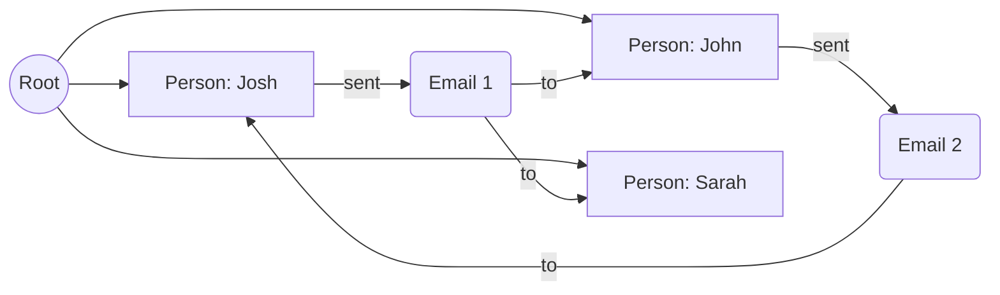

# EmailBuddy: AI Email Assistant

Build an intelligent email assistant that transforms your inbox into a searchable knowledge graph.

**Time:** 60 minutes
**Level:** Intermediate

---

## What You'll Build

**EmailBuddy** is an agentic AI email assistant that:

- Stores emails as an interconnected graph
- Answers questions about your email history
- Summarizes conversations and threads
- Uses semantic search to find relevant messages

---

## Why This Example?

EmailBuddy demonstrates three key Jac principles:

| Concept | How It's Used |
|---------|---------------|
| **Object-Spatial Programming** | Emails and people as connected nodes |
| **AI Agents (byLLM)** | LLM-powered graph traversal and decision-making |
| **Scale-Native** | Walkers become API endpoints automatically |

---

## Prerequisites & Key Concepts

- Completed [Part 2: Add AI](../first-app/part2-ai-features.md) (AI integration basics)
- Familiar with [OSP Tutorial](../language/osp.md) (nodes, edges, walkers)

| Concept | Where to Learn |
|---------|----------------|
| `by llm()` functions | [byLLM Quickstart](../ai/quickstart.md), [Part 2](../first-app/part2-ai-features.md) |
| Agentic patterns | [Agentic AI Tutorial](../ai/agentic.md) |
| Nodes & graph modeling | [OSP Tutorial](../language/osp.md) |
| Walker APIs | [Part 3](../first-app/part3-multi-user.md) |

---

## The Problem

Your inbox is a flat list of messages. Finding "what was the final price we agreed on?" requires:

- Keyword searching
- Manual digging
- Scrolling through threads

EmailBuddy transforms this into a graph you can query naturally.

---

## Architecture

### Graph Structure



### Data Model

```jac
node Person {
    has name: str;
    has email: str;
}

node EmailNode {
    has sender: str;
    has recipients: str;
    has date: str;
    has subject: str;
    has body: str;
    has email_uuid: str;
}
```

---

## Key Components

### 1. Building the Graph

When emails are uploaded, EmailBuddy:

1. Extracts sender and recipient addresses
2. Creates Person nodes (if they don't exist)
3. Creates EmailNode nodes
4. Connects everything to root
5. Creates directed edges: person → email → recipients

```jac
walker upload_emails {
    has emails: list[dict];

    can process with `root entry {
        for email in self.emails {
            # Create or find sender
            sender = find_or_create_person(email["from"]);

            # Create email node
            email_node = EmailNode(
                sender=email["from"],
                recipients=email["to"],
                date=email["date"],
                subject=email["subject"],
                body=email["body"],
                email_uuid=generate_uuid(email)
            );

            # Connect to root
            root ++> email_node;

            # Connect sender to email
            sender ++> email_node;

            # Connect email to recipients
            for recipient in parse_recipients(email["to"]) {
                recipient_node = find_or_create_person(recipient);
                email_node ++> recipient_node;
            }
        }

        report {"uploaded": len(self.emails)};
    }
}
```

### 2. Finding Nodes with Walkers

Helper walkers traverse the graph to find specific nodes:

```jac
walker FindSenderNode {
    has target: str;
    has person: Person = None;

    can start with `root entry {
        visit [-->];
        return self.person;
    }

    can search with Person entry {
        if here.email == self.target {
            self.person = here;
            disengage;
        }
    }
}
```

Usage:

```jac
with entry {
    finder = FindSenderNode(target="alice@example.com");
    root spawn finder;
    sender = finder.person;  # Found Person node or None
}
```

### 3. AI-Powered Navigation

The key innovation: an LLM decides how to traverse the graph.

```jac
import from byllm.lib { Model }

glob llm = Model(model_name="gpt-4o-mini");

obj Response {
    has option: str;      # @selected@, @query@, or @end@
    has selection: str;   # Chosen node, query, or answer
    has explanation: str; # Why this decision
}

sem Response = "Structured response for agentic traversal.";
sem Response.option = "Control token: @selected@, @query@, or @end@.";

"""Decide which option is best: explore an email, search for more, or answer."""
def choose_next_email_node(
    person: str,
    sent: list[str],
    received: list[str],
    conversation_history: list[dict]
) -> Response by llm();
```

### 4. The Query Walker

The main walker uses the AI agent to answer questions:

```jac
walker ask_email {
    has query: str;
    has conversation_history: list[dict] = [];

    can start with `root entry {
        # Append user query to history
        self.conversation_history.append({
            "role": "user",
            "content": self.query
        });

        # Start exploration
        visit [-->](`?Person);
    }

    can explore with Person entry {
        # Gather context from current person
        sent_emails = [here -->](`?EmailNode);
        received_emails = [<-- here](`?EmailNode);

        # Ask AI what to do next
        response = choose_next_email_node(
            here.name,
            format_emails(sent_emails),
            format_emails(received_emails),
            self.conversation_history
        );

        if response.option == "@selected@" {
            # Visit selected email
            visit [-->](`?EmailNode).filter(
                lambda e: any -> bool { e.email_uuid == response.selection; }
            );
        } elif response.option == "@query@" {
            # Semantic search for more emails
            results = semantic_search(response.selection);
            visit results;
        } elif response.option == "@end@" {
            # Return final answer
            report {"answer": response.selection};
            disengage;
        }
    }
}
```

---

## Summarization Agent

Keep the LLM context efficient by summarizing discoveries:

```jac
"""Summarize relevant information from emails for the conversation."""
def summarize(
    presented_options: list[str],
    convo_history: list[dict]
) -> str by llm();
```

This prevents the context window from overflowing as the walker explores more nodes.

---

## Running EmailBuddy

### Start the Server

```bash
jac start server.jac
```

API documentation at `http://localhost:8000/docs`

### Upload Emails

```bash
curl -X POST http://localhost:8000/walker/upload_emails \
  -H "Content-Type: application/json" \
  -d '{
    "emails": [
      {
        "date": "2025-01-15T10:00:00Z",
        "from": "alice@example.com",
        "to": "bob@example.com",
        "subject": "Project update",
        "body": "The final price is $5,000."
      }
    ]
  }'
```

### Query the Assistant

```bash
curl -X POST http://localhost:8000/walker/ask_email \
  -H "Content-Type: application/json" \
  -d '{"query": "What was the final price we agreed on?"}'
```

Response:

```json
{
  "answer": "Based on your email with Alice on January 15th, the final price agreed upon was $5,000."
}
```

---

## Web Interface

EmailBuddy includes a web chat interface:

```javascript
// Query the walker from JavaScript
$.ajax({
    url: 'http://localhost:8000/walker/ask_email',
    method: 'POST',
    contentType: 'application/json',
    data: JSON.stringify({ query: message }),
    success: function(response) {
        displayAnswer(response.answer);
    }
});
```

---

## Key Takeaways

1. **Graphs capture relationships** - Emails aren't just data, they're connections between people
2. **Walkers explore intelligently** - AI-powered traversal finds relevant information
3. **byLLM simplifies agents** - Define behavior with types and `sem`, not manual prompts
4. **Scale-native deploys anywhere** - Same code runs locally or in the cloud

---

## Common Pitfalls

| Mistake | Symptom | Fix |
|---------|---------|-----|
| Nodes not connected to root | Walker can't find them | `root ++> newNode` |
| Duplicate emails | Repeated nodes in graph | Check UUID before creating |
| Walker runs forever | Infinite traversal | Use `disengage` when done |
| LLM context overflow | Poor answers | Use summarization agent |

---

## Full Source Code

- [GitHub Repository](https://github.com/Jaseci-Labs/jaseci/tree/main/jac-byllm/examples/agentic_ai/email-buddy)

---

## Next Examples

- [RAG Chatbot](rag-chatbot.md) - Document Q&A with vector search
- [LittleX](littlex.md) - Social media platform
