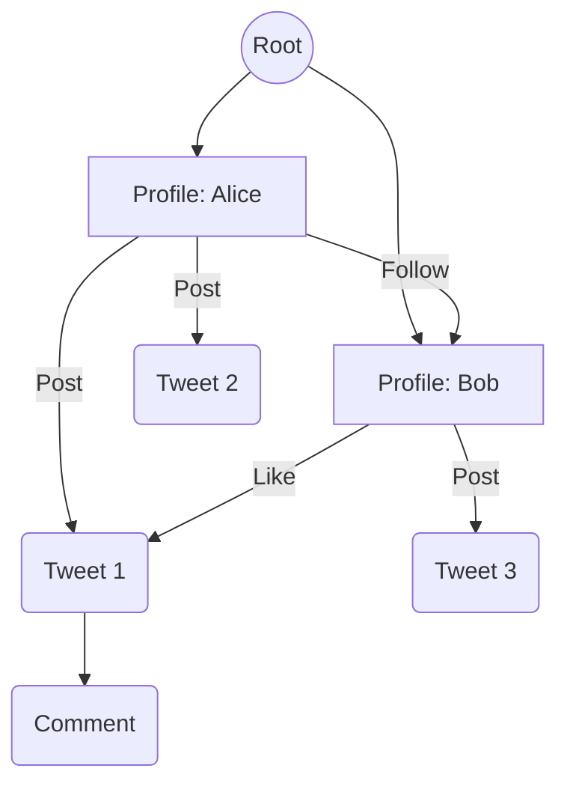

# LittleX: Twitter Clone in 200 Lines

Build a complete social media platform using Jac's graph-based architecture.

**Time:** 45 minutes
**Level:** Intermediate

---

## What You'll Build

**LittleX** is a Twitter-like application featuring:

- User profiles and authentication
- Posting tweets
- Following other users
- Personalized feed
- Comments and likes

All in just **200 lines of Jac code**.

---

## Why This Example?

LittleX demonstrates:

| Concept | How It's Used |
|---------|---------------|
| **Nodes** | Store profiles, tweets, comments |
| **Edges** | Model follows, likes, posts |
| **Walkers** | Create tweets, load feeds, follow users |
| **`jac start`** | Deploy as REST API |

Social networks are naturally graph-shaped. Jac's OSP model makes building them intuitive.

---

## Prerequisites

- Jac installed (`pip install jaseci`)
- Completed [What Makes Jac Different](../../quick-guide/what-makes-jac-different.md) and [Part 1: Todo App](../first-app/part1-todo-app.md)
- Basic understanding of Jac syntax

**Key concepts used:**

| Concept | Where to Learn |
|---------|----------------|
| Nodes & edges | [What Makes Jac Different](../../quick-guide/what-makes-jac-different.md), [OSP Tutorial](../language/osp.md) |
| Walkers & `report` | [OSP Tutorial](../language/osp.md), [Part 3](../first-app/part3-multi-user.md) |
| `jac start` API | [Part 1: Todo App](../first-app/part1-todo-app.md) |
| Typed edges | [OSP Tutorial](../language/osp.md#edges-named-relationships) |

---

## Quick Start

```bash
# Clone the example
git clone https://github.com/Jaseci-Labs/littleX.git
cd littleX

# Install dependencies
pip install -r littleX_BE/requirements.txt

# Start the backend
jac start littleX_BE/littleX.jac
```

API running at `http://localhost:8000/docs`

---

## The Data Model

### Nodes

```jac
node Profile {
    has username: str = "";
    has bio: str = "";
    has avatar_url: str = "";
}

node Tweet {
    has content: str;
    has created_at: str;
    has embedding: list;  # For semantic search
}

node Comment {
    has content: str;
    has created_at: str;
}
```

### Edges

```jac
edge Post {}      # Profile -> Tweet
edge Follow {}    # Profile -> Profile
edge Like {}      # Profile -> Tweet
edge Reply {}     # Tweet -> Comment
```

### Graph Structure



---

## Key Walkers

### Create a Tweet

```jac
walker create_tweet {
    has content: str;

    can tweet with Profile entry {
        # Create tweet node
        tweet = Tweet(
            content=self.content,
            created_at=datetime.now().isoformat()
        );

        # Connect to profile
        here +>: Post() :+> tweet;

        report {"id": tweet.id, "content": tweet.content};
    }
}
```

### Follow a User

```jac
walker follow_user {
    has target_username: str;

    can follow with Profile entry {
        # Find target profile
        for profile in [root -->](?:Profile) {
            if profile.username == self.target_username {
                # Create follow edge
                here +>: Follow() :+> profile;
                report {"following": profile.username};
                return;
            }
        }
        report {"error": "User not found"};
    }
}
```

### Load Feed

```jac
import from datetime { datetime }

walker load_feed {
    has limit: int = 20;

    can gather with Profile entry {
        tweets: list = [];

        # Get own tweets
        for tweet in [here ->:Post:-> (?:Tweet)] {
            tweets.append(tweet);
        }

        # Get tweets from followed users
        for followed in [here ->:Follow:-> (?:Profile)] {
            for tweet in [followed ->:Post:-> (?:Tweet)] {
                tweets.append(tweet);
            }
        }

        # Sort by date, limit results
        sorted_tweets = sorted(tweets, key=lambda t: any -> any { t.created_at; }, reverse=True);
        report sorted_tweets[:self.limit];
    }
}
```

---

## Running the App

### Backend

```bash
cd littleX_BE
jac start littleX.jac
```

### Frontend (Optional)

```bash
cd littleX_FE
npm install
npm run dev
```

Open `http://localhost:5173` in your browser.

---

## API Endpoints

| Endpoint | Description |
|----------|-------------|
| `POST /create_tweet` | Create a new tweet |
| `POST /follow_user` | Follow another user |
| `GET /load_feed` | Get personalized feed |
| `POST /like_tweet` | Like a tweet |
| `POST /comment` | Comment on a tweet |

---

## Testing

```jac
import from datetime { datetime }

test "create tweet" {
    # Setup
    profile = root ++> Profile(username="testuser");

    # Create tweet
    root spawn create_tweet(content="Hello, World!");

    # Verify
    tweets = [profile[0] ->:Post:-> (?:Tweet)];
    assert len(tweets) == 1;
    assert tweets[0].content == "Hello, World!";
}

test "follow user" {
    # Setup
    alice = root ++> Profile(username="alice");
    bob = root ++> Profile(username="bob");

    # Alice follows Bob
    alice[0] spawn follow_user(target_username="bob");

    # Verify
    following = [alice[0] ->:Follow:-> (?:Profile)];
    assert len(following) == 1;
    assert following[0].username == "bob";
}
```

Run tests:

```bash
jac test littleX.jac
```

---

## Extensions to Try

1. **Retweets** - Add a Retweet edge type
2. **Hashtags** - Extract and index hashtags from tweets
3. **Search** - Use embeddings for semantic tweet search
4. **Notifications** - Track new followers, likes, comments
5. **Direct Messages** - Private messaging between users

---

## Full Source Code

The complete source code is available at:

- [GitHub: Jaseci-Labs/littleX](https://github.com/Jaseci-Labs/littleX)

---

## Key Takeaways

1. **Graphs model relationships naturally** - Social networks are inherently graph-shaped
2. **Walkers traverse and modify** - Move through the graph to gather or update data
3. **Edges carry meaning** - Follow, Like, Post edges define relationship types
4. **`jac start` deploys instantly** - Your walkers become API endpoints

---

## Next Examples

- [EmailBuddy](emailbuddy.md) - AI-powered email assistant
- [RAG Chatbot](rag-chatbot.md) - Document Q&A with retrieval
