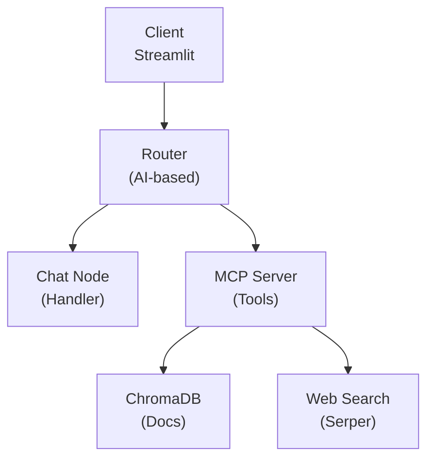

# RAG Chatbot: Multimodal Document Q&A

Build an AI-powered chatbot that can chat with your documents, images, and videos.

**Time:** 60 minutes
**Level:** Advanced

---

## What You'll Build

A multimodal chatbot that can:

- Upload and chat with PDFs, text files, images, and videos
- Search documents and provide context-aware answers
- Answer general questions using web search
- Understand images and videos using AI vision
- Route different question types to specialized handlers

---

## Why This Example?

This example demonstrates advanced Jac concepts:

| Concept | How It's Used |
|---------|---------------|
| **Object-Spatial Programming** | Node-walker architecture for clean organization |
| **byLLM** | AI classifies and routes user queries automatically |
| **Model Context Protocol (MCP)** | Build modular, reusable AI tools |
| **Multimodal AI** | Work with text, images, and videos together |

---

## Prerequisites & Key Concepts

- Completed the [AI Integration](../ai/quickstart.md) tutorials
- Familiar with [OSP](../language/osp.md) (node-walker architecture)

| Concept | Where to Learn |
|---------|----------------|
| `by llm()` | [byLLM Quickstart](../ai/quickstart.md) |
| OSP architecture | [OSP Tutorial](../language/osp.md) |
| Structured outputs | [Structured Outputs](../ai/structured-outputs.md) |
| Tool calling / MCP | [Agentic AI](../ai/agentic.md) |

---

## Architecture Overview



---

## Project Structure

```
rag-chatbot/
├── client.jac         # Streamlit web interface
├── server.jac         # Main application (OSP structure)
├── server.impl.jac    # Implementation details
├── mcp_server.jac     # Tool server (doc search, web search)
├── mcp_client.jac     # Interface to tool server
└── tools.jac          # Document processing logic
```

---

## Key Components

### 1. Chat Nodes (Query Types)

Define different types of queries the system handles:

```jac
node Router {}

"""Chat about uploaded documents."""
node DocumentChat {}

"""Answer general knowledge questions."""
node GeneralChat {}

"""Analyze and discuss images."""
node ImageChat {}

"""Analyze and discuss videos."""
node VideoChat {}
```

### 2. Intelligent Routing

The AI automatically routes queries to the right handler:

```jac
import from byllm.lib { Model }

glob llm = Model(model_name="gpt-4o-mini");

enum QueryType {
    DOCUMENT = "document",
    GENERAL = "general",
    IMAGE = "image",
    VIDEO = "video"
}

"""Classify the user's query to determine the best handler."""
def classify_query(query: str, has_documents: bool) -> QueryType by llm();
```

### 3. Walker-Based Interaction

```jac
walker interact {
    has query: str;
    has session_id: str;

    can route with Router entry {
        # Get session context
        session = get_session(self.session_id);

        # AI classifies the query
        query_type = classify_query(
            self.query,
            has_documents=len(session.documents) > 0
        );

        # Route to appropriate handler
        match query_type {
            case QueryType.DOCUMENT: visit [-->](`?DocumentChat);
            case QueryType.GENERAL: visit [-->](`?GeneralChat);
            case QueryType.IMAGE: visit [-->](`?ImageChat);
            case QueryType.VIDEO: visit [-->](`?VideoChat);
        }
    }

    can handle_document with DocumentChat entry {
        # Search documents for context
        context = search_documents(self.query, self.session_id);

        # Generate answer with RAG
        answer = generate_rag_response(self.query, context);
        report {"answer": answer, "sources": context.sources};
    }

    can handle_general with GeneralChat entry {
        # Use web search for current information
        search_results = web_search(self.query);

        # Generate answer with web context
        answer = generate_web_response(self.query, search_results);
        report {"answer": answer};
    }
}
```

### 4. Document Processing (tools.jac)

```jac
import from langchain_chroma { Chroma }
import from langchain_openai { OpenAIEmbeddings }

def process_document(file_path: str, session_id: str) -> None {
    # Load document
    content = load_file(file_path);

    # Split into chunks
    chunks = split_text(content, chunk_size=1000);

    # Store in vector database
    embeddings = OpenAIEmbeddings();
    vectorstore = Chroma(
        collection_name=session_id,
        embedding_function=embeddings
    );

    vectorstore.add_texts(chunks);
}

def search_documents(query: str, session_id: str) -> list {
    vectorstore = get_vectorstore(session_id);
    results = vectorstore.similarity_search(query, k=5);
    return results;
}
```

### 5. MCP Tool Server

```jac
# mcp_server.jac
import requests;
import os;

"""Search uploaded documents for relevant information."""
@tool
def document_search(query: str, session_id: str) -> str {
    results = search_documents(query, session_id);
    return format_results(results);
}

"""Search the web for current information."""
@tool
def web_search(query: str) -> str {
    response = requests.post(
        "https://google.serper.dev/search",
        headers={"X-API-KEY": os.getenv("SERPER_API_KEY")},
        json={"q": query}
    );

    return format_web_results(response.json());
}
```

---

## Running the Application

### Prerequisites

```bash
pip install jaclang jac-scale jac-streamlit byllm \
  langchain langchain-community langchain-openai langchain-chroma \
  chromadb openai pypdf tiktoken requests mcp[cli] anyio
```

Set API keys:

```bash
export OPENAI_API_KEY=your-key
export SERPER_API_KEY=your-key  # Free at serper.dev
```

### Start the Services

Terminal 1 - Tool server:

```bash
jac mcp_server.jac
```

Terminal 2 - Main application:

```bash
jac start server.jac
```

Terminal 3 - Web interface:

```bash
jac streamlit client.jac
```

Open `http://localhost:8501` in your browser.

---

## Testing the Chatbot

1. **Register and log in** using the web interface
2. **Upload files**: PDFs, text files, images, or videos
3. **Ask questions**:
   - "What does the contract say about termination?" (document)
   - "What's the weather in Tokyo?" (web search)
   - "What's in this image?" (vision)
   - "Summarize this video" (video analysis)

---

## API Endpoints

| Endpoint | Description |
|----------|-------------|
| `POST /user/register` | Create account |
| `POST /user/login` | Get access token |
| `POST /walker/upload_file` | Upload documents |
| `POST /walker/interact` | Chat with the AI |

Full API docs at `http://localhost:8000/docs`

---

## Extension Ideas

1. **New file types** - Audio, spreadsheets, presentations
2. **Additional tools** - Weather, databases, APIs
3. **Hybrid search** - Combine keyword and semantic search
4. **Memory** - Long-term conversation memory across sessions
5. **Custom models** - Specialized LLMs for different domains

---

## Full Source Code

- [GitHub Repository](https://github.com/jaseci-labs/Agentic-AI/tree/main/jac-mcp-chatbot)

---

## Key Takeaways

1. **OSP organizes complexity** - Nodes for query types, walkers for actions
2. **AI-based routing** - Let the LLM decide which handler to use
3. **MCP for modularity** - Tools are independent, reusable services
4. **Vector search for RAG** - Semantic search finds relevant context

---

## Next Examples

- [EmailBuddy](emailbuddy.md) - Agentic email assistant
- [RPG Generator](rpg.md) - AI-generated game content
