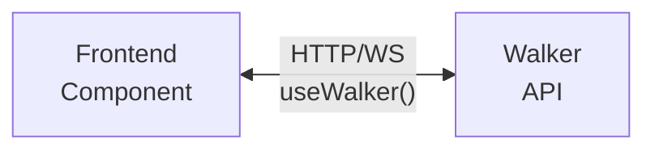

# Backend Integration

Connect your frontend components to Jac walkers for data fetching and mutations.

> **Prerequisites**
>
> - Completed: [State Management](state.md)
> - Familiar with: [What Makes Jac Different](../../quick-guide/what-makes-jac-different.md) (core concepts)
> - Time: ~30 minutes

---

## How It Works

In Jac full-stack apps:

1. **Backend** = Walkers that process data and return results
2. **Frontend** = Components in `cl { }` blocks
3. **Connection** = `useWalker` hook fetches walker results



---

## Setting Up the Backend

### Define Your Data Model

```jac
node Task {
    has id: str;
    has title: str;
    has created_at: str;
    has completed: bool = False;
}
```

### Create Walker Endpoints

```jac
import from datetime { datetime }
import uuid;

walker:pub get_tasks {
    can fetch with `root entry {
        tasks = [-->](`?Task);
        report [
            {
                "id": t.id,
                "title": t.title,
                "completed": t.completed,
                "created_at": t.created_at
            }
            for t in tasks
        ];
    }
}

walker:pub add_task {
    has title: str;

    can create with `root entry {
        new_task = Task(
            id=str(uuid.uuid4()),
            title=self.title,
            completed=False,
            created_at=datetime.now().isoformat()
        );
        root ++> new_task;
        report {
            "id": new_task.id,
            "title": new_task.title,
            "completed": new_task.completed
        };
    }
}

walker:pub toggle_task {
    has task_id: str;

    can toggle with `root entry {
        for task in [-->](`?Task) {
            if task.id == self.task_id {
                task.completed = not task.completed;
                report {"success": True, "completed": task.completed};
                return;
            }
        }
        report {"success": False, "error": "Task not found"};
    }
}

walker:pub delete_task {
    has task_id: str;

    can remove with `root entry {
        for task in [-->](`?Task) {
            if task.id == self.task_id {
                del task;
                report {"success": True};
                return;
            }
        }
        report {"success": False, "error": "Task not found"};
    }
}
```

---

## The useWalker Hook

### Basic Usage

```jac
cl {
    import from jac_client { useWalker }

    def:pub TaskList() -> any {
        # Fetch data from walker
        (data, loading, error, refetch) = useWalker("get_tasks");

        if loading {
            return <p>Loading tasks...</p>;
        }

        if error {
            return <p className="error">Error: {error}</p>;
        }

        return <ul>
            {data.map(lambda task: any -> any {
                return <li key={task["id"]}>{task["title"]}</li>;
            })}
        </ul>;
    }
}
```

### useWalker Returns

| Value | Type | Description |
|-------|------|-------------|
| `data` | any | Walker's reported data |
| `loading` | bool | True while fetching |
| `error` | str | Error message if failed |
| `refetch` | function | Call to re-fetch data |

---

## Passing Parameters to Walkers

```jac
cl {
    import from jac_client { useWalker }

    def:pub FilteredTasks() -> any {
        has show_completed: bool = False;

        # Pass parameters to walker
        (data, loading, error, refetch) = useWalker(
            "get_tasks",
            {"filter_completed": show_completed}
        );

        return <div>
            <label>
                <input
                    type="checkbox"
                    checked={show_completed}
                    onChange={lambda -> None {
                        show_completed = not show_completed;
                    }}
                />
                Show completed only
            </label>

            {loading and <p>Loading...</p>}

            <ul>
                {data and data.map(lambda task: any -> any {
                    return <li key={task["id"]}>{task["title"]}</li>;
                })}
            </ul>
        </div>;
    }
}
```

---

## Mutations with callWalker

For create, update, delete operations, use `callWalker`:

```jac
cl {
    import from jac_client { useWalker, callWalker }

    def:pub TaskManager() -> any {
        has new_title: str = "";

        # Fetch tasks
        (tasks, loading, error, refetch) = useWalker("get_tasks");

        # Add new task
        async def handle_add() -> None {
            if new_title {
                result = await callWalker("add_task", {"title": new_title});
                if result {
                    new_title = "";
                    refetch();  # Refresh the list
                }
            }
        }

        # Toggle task completion
        async def handle_toggle(task_id: str) -> None {
            await callWalker("toggle_task", {"task_id": task_id});
            refetch();
        }

        # Delete task
        async def handle_delete(task_id: str) -> None {
            await callWalker("delete_task", {"task_id": task_id});
            refetch();
        }

        return <div>
            <div className="add-task">
                <input
                    value={new_title}
                    onChange={lambda e: any -> None { new_title = e.target.value; }}
                    placeholder="New task..."
                />
                <button onClick={lambda -> None { handle_add(); }}>
                    Add
                </button>
            </div>

            {loading and <p>Loading...</p>}

            <ul className="task-list">
                {tasks and tasks.map(lambda task: any -> any {
                    return <li key={task["id"]}>
                        <input
                            type="checkbox"
                            checked={task["completed"]}
                            onChange={lambda -> None { handle_toggle(task["id"]); }}
                        />
                        <span className={task["completed"] and "completed"}>
                            {task["title"]}
                        </span>
                        <button onClick={lambda -> None { handle_delete(task["id"]); }}>
                            Delete
                        </button>
                    </li>;
                })}
            </ul>
        </div>;
    }
}
```

---

## Error Handling

### Try-Catch Pattern

```jac
cl {
    import from jac_client { callWalker }

    def:pub SafeSubmit() -> any {
        has error_msg: str = "";
        has submitting: bool = False;

        async def handle_submit(data: dict) -> None {
            submitting = True;
            error_msg = "";

            try {
                result = await callWalker("submit_data", data);
                if not result["success"] {
                    error_msg = result["error"];
                }
            } except e {
                error_msg = f"Network error: {e}";
            }

            submitting = False;
        }

        return <div>
            {error_msg and <div className="error">{error_msg}</div>}
            <button
                onClick={lambda -> None { handle_submit({"key": "value"}); }}
                disabled={submitting}
            >
                {("Submitting..." if submitting else "Submit")}
            </button>
        </div>;
    }
}
```

### Loading States

```jac
cl {
    def:pub DataView() -> any {
        has data: any = None;
        has loading: bool = True;
        has error: str = "";

        # Pattern: loading → data | error
        if loading {
            return <div className="skeleton">
                <div className="skeleton-line"></div>
                <div className="skeleton-line"></div>
            </div>;
        }

        if error {
            return <div className="error">
                <p>{error}</p>
                <button onClick={lambda -> None { refetch(); }}>
                    Retry
                </button>
            </div>;
        }

        return <div className="data">
            {data}
        </div>;
    }
}
```

---

## Real-Time Updates

### Polling

```jac
cl {
    import from react { useEffect }
    import from jac_client { useWalker }

    def:pub LiveData() -> any {
        (data, loading, error, refetch) = useWalker("get_live_data");

        # Poll every 5 seconds
        useEffect(lambda -> None {
            interval = setInterval(lambda -> None { refetch(); }, 5000);
            return lambda -> None { clearInterval(interval); };
        }, []);

        return <div>
            <p>Last updated: {data and data["timestamp"]}</p>
        </div>;
    }
}
```

### WebSocket (if supported)

```jac
cl {
    import from react { useEffect }
    import from jac_client { useWalkerStream }

    def:pub StreamingData() -> any {
        # Subscribe to walker updates
        (data, connected) = useWalkerStream("watch_updates");

        return <div>
            <span className={("online" if connected else "offline")}>
                {("Connected" if connected else "Disconnected")}
            </span>
            <ul>
                {data.map(lambda item: any -> any {
                    return <li key={item["id"]}>{item["message"]}</li>;
                })}
            </ul>
        </div>;
    }
}
```

---

## Complete Example: Task App

```jac
# backend.jac - Walker endpoints
node Task {
    has id: str;
    has title: str;
    has completed: bool = False;
}

walker:pub get_tasks {
    can fetch with `root entry {
        report [[-->](`?Task)];
    }
}

walker:pub add_task {
    has title: str;

    can create with `root entry {
        import uuid;
        task = Task(id=str(uuid.uuid4()), title=self.title);
        root ++> task;
        report task;
    }
}

walker:pub toggle_task {
    has task_id: str;

    can toggle with `root entry {
        for t in [-->](`?Task) {
            if t.id == self.task_id {
                t.completed = not t.completed;
                report t;
                return;
            }
        }
    }
}
```

```jac
# frontend.jac - UI Component
cl {
    import from jac_client { useWalker, callWalker }

    def:pub app() -> any {
        has input_text: str = "";
        (tasks, loading, _, refetch) = useWalker("get_tasks");

        async def add() -> None {
            if input_text {
                await callWalker("add_task", {"title": input_text});
                input_text = "";
                refetch();
            }
        }

        async def toggle(id: str) -> None {
            await callWalker("toggle_task", {"task_id": id});
            refetch();
        }

        return <div className="app">
            <h1>My Tasks</h1>

            <div className="input-row">
                <input
                    value={input_text}
                    onChange={lambda e: any -> None { input_text = e.target.value; }}
                    onKeyPress={lambda e: any -> None {
                        if e.key == "Enter" { add(); }
                    }}
                />
                <button onClick={lambda -> None { add(); }}>Add</button>
            </div>

            {(
                <p>Loading...</p>
            ) if loading else (
                <ul>
                    {tasks.map(lambda t: any -> any {
                        return <li
                            key={t.id}
                            className={t.completed and "done"}
                            onClick={lambda -> None { toggle(t.id); }}
                        >
                            {("Y " if t.completed else "O ")}{t.title}
                        </li>;
                    })}
                </ul>
            )}
        </div>;
    }
}
```

---

## Key Takeaways

| Concept | Usage |
|---------|-------|
| Fetch data | `useWalker("walker_name")` |
| With params | `useWalker("name", {param: value})` |
| Mutations | `await callWalker("name", {data})` |
| Refresh data | `refetch()` from useWalker |
| Error handling | Check `error` from useWalker |

---

## Next Steps

- [Authentication](auth.md) - Add user login
- [Routing](routing.md) - Multi-page applications
- [Build a Todo App](todo-app.md) - Complete full-stack example with AI integration

**Reference:**

- [Walker Responses](../../reference/language/walker-responses.md) - Understanding `.reports` patterns
- [Graph Operations](../../reference/language/graph-operations.md) - Node creation, traversal, deletion
- [Part III: OSP Reference](../../reference/language/osp.md) - Complete walker and node language reference
