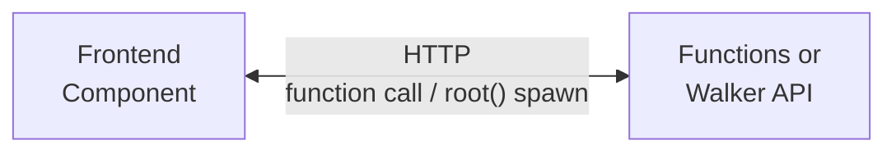

# Backend Integration

The real power of Jac's full-stack model is how seamlessly client components connect to server logic. Instead of manually defining REST endpoints, writing fetch calls, and parsing JSON, you simply call server-side functions or spawn walkers from your client code -- the compiler generates the HTTP layer automatically. Data goes from your graph through walkers, over the network, and into your React-style components with minimal boilerplate.

This tutorial shows how to call backend functions from the frontend, use walkers for graph-based data operations, handle loading states, and structure your server-client communication.

> **Prerequisites**
>
> - Completed: [State Management](state.md)
> - Familiar with: [What Makes Jac Different](../../quick-guide/what-makes-jac-different.md) (core concepts)
> - Time: ~30 minutes

---

## How It Works

In Jac full-stack apps, the compiler handles the client-server boundary for you. Here's the mental model:

1. **Backend** = Functions or walkers that process data and return results
2. **Frontend** = Components in `cl { }` blocks
3. **Connection** = Direct function calls (`await func()`) or walker spawning (`root() spawn Walker()`)


```mermaid
graph LR
    Frontend["Frontend<br/>Component"] <-- "HTTP<br/>function call / root() spawn" --> Backend["Functions or<br/>Walker API"]
```

### Two Backend Approaches

Jac offers two ways to create backend endpoints:

| Approach | Syntax | Best For |
|----------|--------|----------|
| **Functions** | `def:pub get_tasks -> list[Task] { ... }` | Simple CRUD, quick prototyping |
| **Walkers** | `walker:pub get_tasks { can fetch with Root entry { ... } }` | Graph traversal, multi-step operations |

Both become HTTP endpoints automatically. Functions are simpler -- the frontend calls them directly with `await func()`. Walkers are more powerful -- they traverse the graph and report results, called with `root() spawn Walker()`.

Use `def:priv` / `walker:priv` for authenticated endpoints with per-user data isolation. See the [AI Day Planner tutorial](../first-app/build-ai-day-planner.md) for both approaches side by side.

---

## Setting Up the Backend

### Define Your Data Model

```jac
node Task {
    has title: str;
    has created_at: str;
    has completed: bool = False;
}
```

Every node automatically gets a unique identifier from the runtime, accessible via `jid(node)`. You never need to manage IDs manually.

### Create Walker Endpoints

```jac
import from datetime { datetime }

walker:pub get_tasks {
    can fetch with Root entry {
        report [-->][?:Task];  # Reports typed Task nodes directly
    }
}

walker:pub add_task {
    has title: str;

    can create with Root entry {
        new_task = Task(
            title=self.title,
            created_at=datetime.now().isoformat()
        );
        root() ++> new_task;
        report new_task;  # Report the typed Task node
    }
}

walker:pub toggle_task {
    has task_id: str;

    can toggle with Root entry {
        for task in [-->][?:Task] {
            if jid(task) == self.task_id {
                task.completed = not task.completed;
                report task;  # Report the updated Task node
                return;
            }
        }
    }
}

walker:pub delete_task {
    has task_id: str;

    can remove with Root entry {
        for task in [-->][?:Task] {
            if jid(task) == self.task_id {
                del task;
                report {"success": True};
                return;
            }
        }
    }
}
```

---

## Calling Walkers from Frontend

### Basic Pattern with `root() spawn`

Use `root() spawn walker_name()` to call walkers from client code:

```jac
# Import walkers from your main module
sv import from ...main { get_tasks, add_task, toggle_task }

to cl:

def:pub TaskList() -> JsxElement {
    has tasks: list = [];
    has loading: bool = True;
    has error: str = "";

    # Fetch data on component mount
    async can with entry {
        await load_tasks();
    }

    async def load_tasks() -> None {
        loading = True;
        error = "";
        try {
            result = root() spawn get_tasks();
            if result.reports and result.reports.length > 0 {
                tasks = result.reports[0];
            }
        } except Exception as e {
            error = f"Failed to load: {e}";
        }
        loading = False;
    }

    if loading {
        return <p>Loading tasks...</p>;
    }

    if error {
        return <p className="error">Error: {error}</p>;
    }

    return <ul>
        {[<li key={jid(task)}>{task.title}</li> for task in tasks]}
    </ul>;
}
```

### Understanding `root() spawn` Results

| Property | Type | Description |
|----------|------|-------------|
| `result.reports` | list | Array of reported values from walker |
| `result.reports[0]` | any | First reported value (most common) |

---

## Mutations (Create, Update, Delete)

```jac
sv import from ...main { get_tasks, add_task, toggle_task, delete_task }

to cl:

def:pub TaskManager() -> JsxElement {
    has tasks: list = [];
    has new_title: str = "";
    has loading: bool = True;

    # Load tasks on mount
    async can with entry {
        await load_tasks();
    }

    async def load_tasks() -> None {
        loading = True;
        result = root() spawn get_tasks();
        if result.reports and result.reports.length > 0 {
            tasks = result.reports[0];
        }
        loading = False;
    }

    # Add new task
    async def handle_add() -> None {
        if new_title.trim() {
            result = root() spawn add_task(title=new_title.trim());
            if result.reports and result.reports.length > 0 {
                tasks = tasks + [result.reports[0]];
            }
            new_title = "";
        }
    }

    # Toggle task completion
    async def handle_toggle(task_id: str) -> None {
        result = root() spawn toggle_task(task_id=task_id);
        if result.reports and result.reports.length > 0 {
            updated = result.reports[0];
            tasks = [updated if jid(t) == task_id else t for t in tasks];
        }
    }

    # Delete task
    async def handle_delete(task_id: str) -> None {
        result = root() spawn delete_task(task_id=task_id);
        if result.reports and result.reports.length > 0 {
            tasks = [t for t in tasks if jid(t) != task_id];
        }
    }

    return <div>
        <div className="add-task">
            <input
                value={new_title}
                onChange={lambda e: ChangeEvent { new_title = e.target.value; }}
                onKeyDown={lambda e: KeyboardEvent {
                    if e.key == "Enter" { handle_add(); }
                }}
                placeholder="New task..."
            />
            <button onClick={lambda -> None { handle_add(); }}>
                Add
            </button>
        </div>

        {loading and <p>Loading...</p>}

        <ul className="task-list">
            {[
                <li key={jid(task)}>
                    <input
                        type="checkbox"
                        checked={task.completed}
                        onChange={lambda -> None { handle_toggle(jid(task)); }}
                    />
                    <span className={task.completed and "completed"}>
                        {task.title}
                    </span>
                    <button onClick={lambda -> None { handle_delete(jid(task)); }}>
                        Delete
                    </button>
                </li>
                for task in tasks
            ]}
        </ul>
    </div>;
}
```

---

## Error Handling

### Try-Catch Pattern

```jac
sv import from ...main { submit_data }

to cl:

def:pub SafeSubmit() -> JsxElement {
    has error_msg: str = "";
    has submitting: bool = False;

    async def handle_submit(data: dict) -> None {
        submitting = True;
        error_msg = "";

        try {
            result = root() spawn submit_data(payload=data);
            if result.reports and result.reports.length > 0 {
                response = result.reports[0];
                if not response["success"] {
                    error_msg = response["error"];
                }
            }
        } except Exception as e {
            error_msg = f"Network error: {e}";
        }

        submitting = False;
    }

    return <div>
        {error_msg and <div className="error">{error_msg}</div>}
        <button
            onClick={lambda -> None { handle_submit({"key": "value"}); }}
            disabled={submitting}
        >
            {("Submitting..." if submitting else "Submit")}
        </button>
    </div>;
}
```

### Loading States Pattern

```jac
to cl:

def:pub DataView() -> JsxElement {
    has data: any = None;
    has loading: bool = True;
    has error: str = "";

    async can with entry {
        await fetch_data();
    }

    async def fetch_data() -> None {
        loading = True;
        try {
            result = root() spawn get_data();
            if result.reports and result.reports.length > 0 {
                data = result.reports[0];
            }
        } except Exception as e {
            error = f"Failed to load: {e}";
        }
        loading = False;
    }

    if loading {
        return <div className="skeleton">
            <div className="skeleton-line"></div>
            <div className="skeleton-line"></div>
        </div>;
    }

    if error {
        return <div className="error">
            <p>{error}</p>
            <button onClick={lambda -> None { fetch_data(); }}>
                Retry
            </button>
        </div>;
    }

    return <div className="data">
        {JSON.stringify(data)}
    </div>;
}
```

---

## Real-Time Updates

### Polling Pattern

```jac
to cl:

import from react { useEffect }

def:pub LiveData() -> JsxElement {
    has data: any = None;
    has loading: bool = True;

    async def fetch_data() -> None {
        result = root() spawn get_live_data();
        if result.reports and result.reports.length > 0 {
            data = result.reports[0];
        }
        loading = False;
    }

    # Initial fetch
    async can with entry {
        await fetch_data();
    }

    # Poll every 5 seconds
    useEffect(lambda -> None {
        interval = setInterval(lambda -> None { fetch_data(); }, 5000);
        return lambda -> None { clearInterval(interval); };
    }, []);

    return <div>
        {loading and <p>Loading...</p>}
        {data and <p>Last updated: {data["timestamp"]}</p>}
    </div>;
}
```

---

## Complete Example: Task App

```jac
# main.jac - Combined backend and frontend

# === Backend: Data Model ===
node Task {
    has title: str;
    has completed: bool = False;
}

# === Backend: Walkers ===
walker:pub get_tasks {
    can fetch with Root entry {
        report [-->][?:Task];
    }
}

walker:pub add_task {
    has title: str;

    can create with Root entry {
        task = Task(title=self.title);
        root() ++> task;
        report task;
    }
}

walker:pub toggle_task {
    has task_id: str;

    can toggle with Root entry {
        for t in [-->][?:Task] {
            if jid(t) == self.task_id {
                t.completed = not t.completed;
                report t;
                return;
            }
        }
    }
}

# === Frontend: UI ===
to cl:

def:pub app() -> JsxElement {
    has tasks: list = [];
    has input_text: str = "";
    has loading: bool = True;

    # Load tasks on mount
    async can with entry {
        result = root() spawn get_tasks();
        if result.reports {
            tasks = result.reports;
        }
        loading = False;
    }

    async def add() -> None {
        if input_text.trim() {
            result = root() spawn add_task(title=input_text.trim());
            if result.reports and result.reports.length > 0 {
                tasks = tasks + [result.reports[0]];
            }
            input_text = "";
        }
    }

    async def toggle(task_id: str) -> None {
        result = root() spawn toggle_task(task_id=task_id);
        if result.reports and result.reports.length > 0 {
            updated = result.reports[0];
            tasks = [updated if jid(t) == task_id else t for t in tasks];
        }
    }

    return <div className="app">
        <h1>My Tasks</h1>

        <div className="input-row">
            <input
                value={input_text}
                onChange={lambda e: ChangeEvent { input_text = e.target.value; }}
                onKeyDown={lambda e: KeyboardEvent {
                    if e.key == "Enter" { add(); }
                }}
                placeholder="Add a task..."
            />
            <button onClick={lambda -> None { add(); }}>Add</button>
        </div>

        {loading and <p>Loading...</p>}

        {not loading and (
            <ul>
                {[
                    <li
                        key={jid(t)}
                        style={{"textDecoration": t.completed and "line-through"}}
                        onClick={lambda -> None { toggle(jid(t)); }}
                    >
                        {t.title}
                    </li>
                    for t in tasks
                ]}
            </ul>
        )}
    </div>;
}
```

---

## Key Takeaways

| Concept | Usage |
|---------|-------|
| Import walkers | `sv import from ...main { walker_name }` |
| Call walker | `result = root() spawn walker_name(args)` |
| Get results | `result.reports[0]` |
| Node spawn | `node_id spawn walker_name(args)` |
| Error handling | `try { ... } except Exception as e { ... }` |

---

## Next Steps

- [Authentication](auth.md) - Add user login
- [Routing](routing.md) - Multi-page applications
- [Build an AI Day Planner](../first-app/build-ai-day-planner.md) - Complete full-stack example with AI integration

**Reference:**

- [Walker Responses](../../reference/language/walker-responses.md) - Understanding `.reports` patterns
- [Graph Operations](../../reference/language/osp.md) - Node creation, traversal, deletion
- [Part III: OSP Reference](../../reference/language/osp.md) - Complete walker and node language reference
