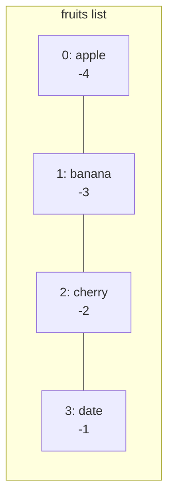
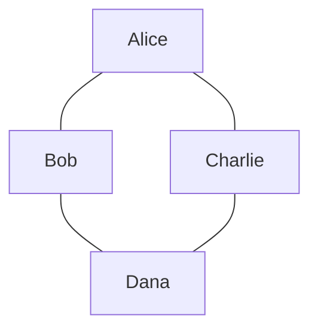
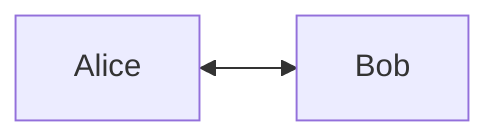
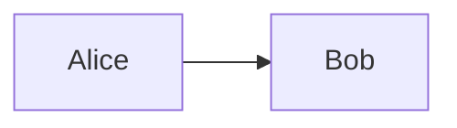
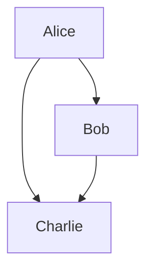

# The Complete Beginner's Guide to Programming with Jac

> **Welcome to Programming!** This guide will teach you how to program using Jac as your first programming language. No prior experience required. We'll start from the absolute basics and build up to advanced concepts step by step.

---

## Table of Contents

1. [Introduction: What is Programming?](#1-introduction-what-is-programming)
2. [Setting Up: Your First Program](#2-setting-up-your-first-program)
3. [The Basics: Variables and Data](#3-the-basics-variables-and-data)
4. [Making Decisions: Control Flow](#4-making-decisions-control-flow)
5. [Repeating Actions: Loops](#5-repeating-actions-loops)
6. [Organizing Code: Functions](#6-organizing-code-functions)
7. [Collections: Working with Multiple Values](#7-collections-working-with-multiple-values)
8. [Grouping Things: Classes and Objects](#8-grouping-things-classes-and-objects)
9. [Understanding Relationships: Graphs](#9-understanding-relationships-graphs)
10. [The Magic of Jac: Object-Spatial Programming](#10-the-magic-of-jac-object-spatial-programming)
11. [Putting It All Together: Complete Examples](#11-putting-it-all-together-complete-examples)
12. [What's Next?](#12-whats-next)

---

## 1. Introduction: What is Programming?

Programming is giving instructions to a computer. Just like you might give directions to a friend ("turn left, then go straight"), you give instructions to a computer using a programming language.

### Why Jac?

Jac is special because it teaches you **two ways of thinking**:

1. **Traditional Programming** - Like most languages (Python, JavaScript, Java)
2. **Object-Spatial Programming (OSP)** - A new way to think about how data and computation work together

Think of it this way:

- **Traditional Programming**: You call a restaurant and order food to be delivered to you
- **Object-Spatial Programming**: You send a robot to visit different restaurants and collect food

Both get you fed, but they work differently! By the end of this guide, you'll understand both approaches.

---

## 2. Setting Up: Your First Program

Every Jac program needs a place to start. We use a special block called `with entry`:

<div class="code-block">

```jac
with entry {
    print("Hello, World!");
}
```

</div>

**What's happening here?**

- `with entry` - This is where your program starts
- `print()` - This is a **function** that displays text on the screen
- `"Hello, World!"` - This is text (called a **string**)
- `;` - Every instruction ends with a semicolon
- `{}` - Curly braces group instructions together

**Try it yourself:** Change "Hello, World!" to your name!

<div class="code-block">

```jac
with entry {
    print("Hello, my name is Alice!");
}
```

</div>

---

## 3. The Basics: Variables and Data

### 3.1 What is a Variable?

A variable is like a labeled box where you store information. You give it a name, and you can put different things in it.

<div class="code-block">

```jac
with entry {
    # Create a variable
    name = "Alice";
    age = 25;
    height = 5.6;

    print(name);    # Shows: Alice
    print(age);     # Shows: 25
}
```

</div>

**Lines starting with `#` are comments** - they're notes for humans, the computer ignores them.

### 3.2 Types of Data

Just like in real life, data comes in different types:

#### Text (Strings)

<div class="code-block">

```jac
with entry {
    greeting = "Hello";
    name = "Bob";
    message = "Welcome to Jac!";

    print(greeting);  # Shows: Hello
}
```

</div>

Strings go inside quotes: `"like this"` or `'like this'`

#### Numbers (Integers)

<div class="code-block">

```jac
with entry {
    apples = 5;
    students = 30;
    year = 2024;

    print(apples);  # Shows: 5
}
```

</div>

Whole numbers with no decimal point.

#### Numbers (Floats)

<div class="code-block">

```jac
with entry {
    temperature = 72.5;
    price = 19.99;
    pi = 3.14159;

    print(temperature);  # Shows: 72.5
}
```

</div>

Numbers with decimal points.

#### True or False (Booleans)

<div class="code-block">

```jac
with entry {
    is_raining = True;
    is_sunny = False;

    print(is_raining);  # Shows: True
}
```

</div>

Only two values: `True` or `False` (notice the capital letters!)

### 3.3 Type Annotations (Recommended!)

You can tell Jac what type of data a variable should hold:

<div class="code-block">

```jac
with entry {
    name: str = "Alice";      # str means string (text)
    age: int = 25;            # int means integer (whole number)
    height: float = 5.6;      # float means decimal number
    is_student: bool = True;  # bool means boolean (True/False)

    print(f"{name} is {age} years old");
}
```

</div>

**Pro tip:** The `f` before a string lets you insert variables using `{variable_name}`

### 3.4 Doing Math

You can calculate with numbers:

<div class="code-block">

```jac
with entry {
    # Basic math
    sum = 5 + 3;        # Addition: 8
    difference = 10 - 4; # Subtraction: 6
    product = 6 * 7;     # Multiplication: 42
    quotient = 20 / 4;   # Division: 5.0

    print(sum);         # Shows: 8
    print(product);     # Shows: 42

    # More operations
    remainder = 17 % 5;  # Modulo (remainder): 2
    power = 2 ** 3;      # Exponent: 8 (2³)

    # Combined operations
    total = (5 + 3) * 2;  # Use parentheses like in math: 16

    print(total);
}
```

</div>

### 3.5 Changing Variables

Variables can change their value:

<div class="code-block">

```jac
with entry {
    score = 0;
    print(score);    # Shows: 0

    score = 10;
    print(score);    # Shows: 10

    score = score + 5;  # Add 5 to current value
    print(score);    # Shows: 15

    # Shortcut for score = score + 5
    score += 5;
    print(score);    # Shows: 20
}
```

</div>

**Common shortcuts:**

- `x += 5` means `x = x + 5` (add 5)
- `x -= 3` means `x = x - 3` (subtract 3)
- `x *= 2` means `x = x * 2` (multiply by 2)
- `x /= 4` means `x = x / 4` (divide by 4)

### 3.6 Practice Exercise

**Challenge:** Create a program that calculates the area of a rectangle.

<div class="code-block">

```jac
with entry {
    # Write your code here
    width: float = 5.0;
    height: float = 3.0;

    area = width * height;

    print(f"The area is {area}");
}
```

</div>

---

## 4. Making Decisions: Control Flow

Programs need to make decisions based on conditions. This is where `if`, `elif`, and `else` come in.

### 4.1 The If Statement

<div class="code-block">

```jac
with entry {
    age = 18;

    if age >= 18 {
        print("You are an adult");
    }
}
```

</div>

**How it works:**

- `if age >= 18` - Check if age is greater than or equal to 18
- If the condition is `True`, run the code inside `{}`
- If the condition is `False`, skip the code inside `{}`

### 4.2 Comparison Operators

These let you compare values:

| Operator | Meaning | Example |
|----------|---------|---------|
| `>` | Greater than | `x > 5` |
| `<` | Less than | `x < 10` |
| `>=` | Greater than or equal | `age >= 18` |
| `<=` | Less than or equal | `score <= 100` |
| `==` | Equal to | `name == "Alice"` |
| `!=` | Not equal to | `status != "done"` |

**Important:** Use `==` to compare (not `=`). Use `=` to assign values!

### 4.3 If-Else

What if you want to do something when the condition is `False`?

<div class="code-block">

```jac
with entry {
    temperature = 72;

    if temperature > 75 {
        print("It's hot outside!");
    } else {
        print("It's nice outside!");
    }
}
```

</div>

### 4.4 If-Elif-Else

What about multiple conditions?

<div class="code-block">

```jac
with entry {
    score = 85;

    if score >= 90 {
        print("Grade: A");
    } elif score >= 80 {
        print("Grade: B");
    } elif score >= 70 {
        print("Grade: C");
    } elif score >= 60 {
        print("Grade: D");
    } else {
        print("Grade: F");
    }
}
```

</div>

**How it works:**

1. Check first `if` - if `True`, run its code and skip the rest
2. If first is `False`, check first `elif`
3. Keep checking until one is `True`
4. If none are `True`, run `else` block

### 4.5 Combining Conditions

You can combine multiple conditions:

<div class="code-block">

```jac
with entry {
    age = 25;
    has_license = True;

    # AND - both must be true
    if age >= 16 and has_license {
        print("You can drive!");
    }

    # OR - at least one must be true
    if age < 18 or age > 65 {
        print("Discounted ticket price!");
    }

    # NOT - reverse the condition
    if not has_license {
        print("You need a license!");
    }
}
```

</div>

### 4.6 Nested Ifs

You can put `if` statements inside other `if` statements:

<div class="code-block">

```jac
with entry {
    weather = "sunny";
    temperature = 80;

    if weather == "sunny" {
        if temperature > 75 {
            print("Perfect beach day!");
        } else {
            print("Nice day for a walk!");
        }
    } else {
        print("Maybe stay inside");
    }
}
```

</div>

### 4.7 Practice Exercise

**Challenge:** Write a program that checks if someone is a child (0-12), teenager (13-19), adult (20-64), or senior (65+).

<div class="code-block">

```jac
with entry {
    age = 17;

    # Your code here
    if age <= 12 {
        print("Child");
    } elif age <= 19 {
        print("Teenager");
    } elif age <= 64 {
        print("Adult");
    } else {
        print("Senior");
    }
}
```

</div>

---

## 5. Repeating Actions: Loops

Loops let you repeat code multiple times without writing it over and over.

### 5.1 The While Loop

Repeat code while a condition is `True`:

<div class="code-block">

```jac
with entry {
    count = 1;

    while count <= 5 {
        print(f"Count is {count}");
        count += 1;  # IMPORTANT: Change the variable or loop forever!
    }

    print("Done!");
}
```

</div>

**Warning:** Make sure your condition eventually becomes `False`, or your loop will run forever!

### 5.2 The For Loop (Counting)

When you know exactly how many times to repeat:

<div class="code-block">

```jac
with entry {
    # Count from 0 to 4
    for i = 0 to i < 5 by i += 1 {
        print(f"Number: {i}");
    }
}
```

</div>

**Breaking it down:**

- `i = 0` - Start at 0
- `to i < 5` - Continue while i is less than 5
- `by i += 1` - Add 1 to i each time

### 5.3 The For-In Loop (Iterating)

Loop through items in a collection:

<div class="code-block">

```jac
with entry {
    # We'll learn about lists soon!
    fruits = ["apple", "banana", "cherry"];

    for fruit in fruits {
        print(f"I like {fruit}");
    }
}
```

</div>

### 5.4 Breaking Out of Loops

Sometimes you want to stop a loop early:

<div class="code-block">

```jac
with entry {
    # Find first number divisible by 7
    for i = 1 to i <= 100 by i += 1 {
        if i % 7 == 0 {
            print(f"Found it: {i}");
            break;  # Exit the loop immediately
        }
    }
}
```

</div>

### 5.5 Skipping Iterations

Skip to the next iteration without running the rest of the loop body:

<div class="code-block">

```jac
with entry {
    # Print only odd numbers
    for i = 1 to i <= 10 by i += 1 {
        if i % 2 == 0 {
            continue;  # Skip even numbers
        }
        print(i);
    }
}
```

</div>

### 5.6 Practice Exercises

**Challenge 1:** Write a loop that prints all multiples of 3 from 3 to 30.

<div class="code-block">

```jac
with entry {
    for i = 3 to i <= 30 by i += 3 {
        print(i);
    }
}
```

</div>

**Challenge 2:** Write a countdown from 10 to 1, then print "Blast off!"

<div class="code-block">

```jac
with entry {
    count = 10;
    while count > 0 {
        print(count);
        count -= 1;
    }
    print("Blast off!");
}
```

</div>

---

## 6. Organizing Code: Functions

Functions are reusable blocks of code that do specific tasks. Think of them as mini-programs within your program.

### 6.1 Creating Your First Function

<div class="code-block">

```jac
# Define the function
def greet {
    print("Hello, there!");
}

with entry {
    # Use (call) the function
    greet();
    greet();
    greet();
}
```

</div>

### 6.2 Functions with Parameters

Make functions more flexible by giving them inputs:

<div class="code-block">

```jac
def greet(name: str) {
    print(f"Hello, {name}!");
}

with entry {
    greet("Alice");
    greet("Bob");
    greet("Charlie");
}
```

</div>

**Breaking it down:**

- `name: str` - This is a **parameter** (input)
- `: str` - Type annotation (optional but recommended)
- When you call `greet("Alice")`, `"Alice"` becomes the value of `name`

### 6.3 Multiple Parameters

Functions can take multiple inputs:

<div class="code-block">

```jac
def add(x: int, y: int) {
    sum = x + y;
    print(f"{x} + {y} = {sum}");
}

with entry {
    add(5, 3);
    add(10, 20);
}
```

</div>

### 6.4 Returning Values

Instead of just printing, functions can send values back:

<div class="code-block">

```jac
def add(x: int, y: int) -> int {
    return x + y;
}

with entry {
    result = add(5, 3);
    print(result);  # Shows: 8

    # Use directly in calculations
    total = add(10, 20) + add(5, 5);
    print(total);  # Shows: 40
}
```

</div>

**Breaking it down:**

- `-> int` - This function returns an integer
- `return x + y;` - Send this value back to whoever called the function
- The returned value can be stored in a variable or used directly

### 6.5 Default Parameters

Give parameters default values:

<div class="code-block">

```jac
def greet(name: str = "friend", excited: bool = False) {
    if excited {
        print(f"HELLO, {name}!!!");
    } else {
        print(f"Hello, {name}.");
    }
}

with entry {
    greet();                          # Uses defaults
    greet("Alice");                   # Uses name, default excited
    greet("Bob", True);               # Both specified
    greet(excited=True, name="Eve");  # Named parameters
}
```

</div>

### 6.6 Why Use Functions?

**1. Avoid Repetition**

Bad:
<div class="code-block">

```jac
with entry {
    print("Welcome!");
    print("Please enter your name.");
    # ... 20 more lines ...

    # Later in code...
    print("Welcome!");
    print("Please enter your name.");
    # ... same 20 lines again ...
}
```

</div>

Good:
<div class="code-block">

```jac
def show_welcome {
    print("Welcome!");
    print("Please enter your name.");
    # ... 20 more lines ...
}

with entry {
    show_welcome();
    # ... later ...
    show_welcome();
}
```

</div>

**2. Break Down Complex Problems**

<div class="code-block">

```jac
def calculate_area(width: float, height: float) -> float {
    return width * height;
}

def calculate_perimeter(width: float, height: float) -> float {
    return 2 * (width + height);
}

def describe_rectangle(width: float, height: float) {
    area = calculate_area(width, height);
    perimeter = calculate_perimeter(width, height);

    print(f"Rectangle: {width} x {height}");
    print(f"Area: {area}");
    print(f"Perimeter: {perimeter}");
}

with entry {
    describe_rectangle(5.0, 3.0);
}
```

</div>

### 6.7 Practice Exercises

**Challenge 1:** Write a function that checks if a number is even.

<div class="code-block">

```jac
def is_even(num: int) -> bool {
    return num % 2 == 0;
}

with entry {
    print(is_even(4));   # True
    print(is_even(7));   # False
}
```

</div>

**Challenge 2:** Write a function that finds the maximum of two numbers.

<div class="code-block">

```jac
def max(a: int, b: int) -> int {
    if a > b {
        return a;
    } else {
        return b;
    }
}

with entry {
    print(max(10, 5));   # 10
    print(max(3, 8));    # 8
}
```

</div>

---

## 7. Collections: Working with Multiple Values

So far, we've stored single values in variables. But what if you want to store multiple related values?

### 7.1 Lists - Ordered Collections

Lists hold multiple values in order:

<div class="code-block">

```jac
with entry {
    # Create a list
    fruits = ["apple", "banana", "cherry"];

    print(fruits);  # ['apple', 'banana', 'cherry']
}
```

</div>

### 7.2 Accessing List Items

Each item has an index (position), starting at 0:

<div class="code-block">

```jac
with entry {
    fruits = ["apple", "banana", "cherry", "date"];

    print(fruits[0]);   # apple (first item)
    print(fruits[1]);   # banana (second item)
    print(fruits[3]);   # date (fourth item)

    # Negative indices count from the end
    print(fruits[-1]);  # date (last item)
    print(fruits[-2]);  # cherry (second to last)
}
```

</div>

**Visual:**



### 7.3 Modifying Lists

<div class="code-block">

```jac
with entry {
    numbers = [1, 2, 3];

    # Change an item
    numbers[1] = 99;
    print(numbers);  # [1, 99, 3]

    # Add to end
    numbers.append(4);
    print(numbers);  # [1, 99, 3, 4]

    # Insert at position
    numbers.insert(0, 0);  # Insert 0 at index 0
    print(numbers);  # [0, 1, 99, 3, 4]

    # Remove by value
    numbers.remove(99);
    print(numbers);  # [0, 1, 3, 4]

    # Remove by index
    numbers.pop(0);  # Remove first item
    print(numbers);  # [1, 3, 4]
}
```

</div>

### 7.4 List Operations

<div class="code-block">

```jac
with entry {
    numbers = [1, 2, 3];

    # Length
    print(len(numbers));  # 3

    # Concatenation
    more_numbers = numbers + [4, 5];
    print(more_numbers);  # [1, 2, 3, 4, 5]

    # Repetition
    repeated = [0] * 5;
    print(repeated);  # [0, 0, 0, 0, 0]

    # Membership
    if 2 in numbers {
        print("Found 2!");
    }
}
```

</div>

### 7.5 Looping Through Lists

<div class="code-block">

```jac
with entry {
    fruits = ["apple", "banana", "cherry"];

    # Loop through items
    for fruit in fruits {
        print(f"I like {fruit}");
    }

    # Loop with index
    for i = 0 to i < len(fruits) by i += 1 {
        print(f"{i}: {fruits[i]}");
    }
}
```

</div>

### 7.6 List Slicing

Get a portion of a list:

<div class="code-block">

```jac
with entry {
    numbers = [0, 1, 2, 3, 4, 5, 6, 7, 8, 9];

    # [start:end] - start is included, end is excluded
    print(numbers[2:5]);   # [2, 3, 4]

    # [:end] - from beginning to end
    print(numbers[:3]);    # [0, 1, 2]

    # [start:] - from start to end of list
    print(numbers[7:]);    # [7, 8, 9]

    # [start:end:step] - with step size
    print(numbers[0:9:2]); # [0, 2, 4, 6, 8]
}
```

</div>

### 7.7 Dictionaries - Key-Value Pairs

Dictionaries store data as key-value pairs:

<div class="code-block">

```jac
with entry {
    # Create a dictionary
    person = {
        "name": "Alice",
        "age": 25,
        "city": "Seattle"
    };

    # Access values by key
    print(person["name"]);  # Alice
    print(person["age"]);   # 25

    # Add or modify
    person["job"] = "Engineer";
    person["age"] = 26;

    print(person);
}
```

</div>

### 7.8 Looping Through Dictionaries

<div class="code-block">

```jac
with entry {
    scores = {
        "Alice": 95,
        "Bob": 87,
        "Charlie": 92
    };

    # Loop through keys
    for name in scores {
        print(f"{name}: {scores[name]}");
    }
}
```

</div>

### 7.9 Tuples - Immutable Lists

Tuples are like lists, but they can't be changed after creation:

<div class="code-block">

```jac
with entry {
    # Create a tuple
    point = (10, 20);

    # Access like a list
    print(point[0]);  # 10
    print(point[1]);  # 20

    # Unpack into variables
    (x, y) = point;
    print(f"x={x}, y={y}");

    # Can't modify!
    # point[0] = 5;  # ERROR!
}
```

</div>

### 7.10 List Comprehensions - Powerful Shortcuts

Create lists in one line:

<div class="code-block">

```jac
with entry {
    # Traditional way
    squares = [];
    for i = 0 to i < 5 by i += 1 {
        squares.append(i ** 2);
    }
    print(squares);  # [0, 1, 4, 9, 16]

    # List comprehension way
    squares = [i ** 2 for i in range(5)];
    print(squares);  # [0, 1, 4, 9, 16]

    # With condition
    evens = [i for i in range(10) if i % 2 == 0];
    print(evens);  # [0, 2, 4, 6, 8]
}
```

</div>

### 7.11 Practice Exercises

**Challenge 1:** Create a list of your 5 favorite foods and print each one.

**Challenge 2:** Create a dictionary of 3 people with their ages, then print the oldest person.

<div class="code-block">

```jac
with entry {
    ages = {"Alice": 25, "Bob": 30, "Charlie": 22};

    oldest_name = "";
    oldest_age = 0;

    for name in ages {
        if ages[name] > oldest_age {
            oldest_age = ages[name];
            oldest_name = name;
        }
    }

    print(f"{oldest_name} is the oldest at {oldest_age}");
}
```

</div>

---

## 8. Grouping Things: Classes and Objects

Classes let you create your own custom types that bundle data and functions together.

### 8.1 What is a Class?

Think of a class as a blueprint for creating objects.

**Real-world analogy:**

- **Class**: Blueprint for a car (defines what all cars have)
- **Object**: An actual car (a specific instance)

### 8.2 Creating Your First Class

<div class="code-block">

```jac
# Define the class (blueprint)
class Dog {
    has name: str = "Unnamed";
    has age: int = 0;

    def bark {
        print(f"{self.name} says Woof!");
    }
}

with entry {
    # Create objects (instances)
    my_dog = Dog();
    my_dog.name = "Buddy";
    my_dog.age = 3;

    your_dog = Dog();
    your_dog.name = "Max";
    your_dog.age = 5;

    # Use the objects
    my_dog.bark();   # Buddy says Woof!
    your_dog.bark(); # Max says Woof!

    print(f"{my_dog.name} is {my_dog.age} years old");
}
```

</div>

**Breaking it down:**

- `class Dog` - Define a new type called Dog
- `has name: str` - Every Dog has a name (property/attribute)
- `def bark` - Every Dog can bark (method)
- `self` - Refers to the current object
- `Dog()` - Create a new Dog object

### 8.3 Constructors - Setting Initial Values

Objects are automatically initialized with their `has` attributes as parameters:

<div class="code-block">

```jac
obj Dog {
    has name: str;
    has age: int;

    def bark {
        print(f"{self.name} says Woof!");
    }

    def birthday {
        self.age += 1;
        print(f"Happy birthday! {self.name} is now {self.age}");
    }
}

with entry {
    my_dog = Dog(name="Buddy", age=3);
    my_dog.bark();
    my_dog.birthday();
}
```

</div>

### 8.4 Why Use Classes?

**1. Group Related Data**

Instead of:
<div class="code-block">

```jac
with entry {
    dog1_name = "Buddy";
    dog1_age = 3;
    dog1_breed = "Labrador";

    dog2_name = "Max";
    dog2_age = 5;
    dog2_breed = "Poodle";

    print(f"Dog 1: {dog1_name}, {dog1_age}, {dog1_breed}");
    print(f"Dog 2: {dog2_name}, {dog2_age}, {dog2_breed}");
}
```

</div>

Use:
<div class="code-block">

```jac
obj Dog {
    has name: str;
    has age: int;
    has breed: str;
}

with entry {
    dog1 = Dog(name="Buddy", age=3, breed="Labrador");
    dog2 = Dog(name="Max", age=5, breed="Poodle");

    print(f"Dog 1: {dog1.name}, {dog1.age}, {dog1.breed}");
    print(f"Dog 2: {dog2.name}, {dog2.age}, {dog2.breed}");
}
```

</div>

**2. Bundle Data with Behavior**

<div class="code-block">

```jac
obj BankAccount {
    has balance: float = 0.0;

    def deposit(amount: float) {
        self.balance += amount;
        print(f"Deposited ${amount}. New balance: ${self.balance}");
    }

    def withdraw(amount: float) {
        if amount <= self.balance {
            self.balance -= amount;
            print(f"Withdrew ${amount}. New balance: ${self.balance}");
        } else {
            print("Insufficient funds!");
        }
    }
}

with entry {
    account = BankAccount();
    account.deposit(100.0);
    account.withdraw(30.0);
    account.withdraw(80.0);  # Insufficient funds!
}
```

</div>

### 8.5 Inheritance - Building on Existing Classes

Create specialized versions of classes:

<div class="code-block">

```jac
# Base object
obj Animal {
    has name: str;
    has age: int;

    def speak {
        print(f"{self.name} makes a sound");
    }
}

# Specialized object
obj Dog(Animal) {  # Dog inherits from Animal
    has breed: str;

    # Override parent method
    def speak {
        print(f"{self.name} barks: Woof!");
    }

    # New method specific to Dog
    def fetch {
        print(f"{self.name} fetches the ball!");
    }
}

obj Cat(Animal) {
    # Override parent method
    def speak {
        print(f"{self.name} meows: Meow!");
    }
}

with entry {
    dog = Dog(name="Buddy", age=3, breed="Labrador");
    cat = Cat(name="Whiskers", age=2);

    dog.speak();  # Buddy barks: Woof!
    cat.speak();  # Whiskers meows: Meow!

    dog.fetch();  # Buddy fetches the ball!
}
```

</div>

**Inheritance lets you:**

- Reuse code from parent classes
- Create specialized versions
- Override methods for custom behavior
- Add new methods to specialized classes

### 8.6 Real Example: A Simple Game Character

<div class="code-block">

```jac
obj Character {
    has name: str;
    has health: int = 100;
    has strength: int = 10;

    def attack(target: object) {
        damage = self.strength;
        print(f"{self.name} attacks {target.name} for {damage} damage!");
        target.take_damage(damage);
    }

    def take_damage(amount: int) {
        self.health -= amount;
        print(f"{self.name} has {self.health} health remaining");

        if self.health <= 0 {
            print(f"{self.name} has been defeated!");
        }
    }
}

obj Warrior(Character) {
    def postinit {
        self.strength = 20;  # Warriors hit harder
    }
}

obj Mage(Character) {
    def postinit {
        self.strength = 15;
    }

    def cast_spell(target: object) {
        damage = self.strength * 2;  # Spells do double damage
        print(f"{self.name} casts fireball at {target.name} for {damage} damage!");
        target.take_damage(damage);
    }
}

with entry {
    warrior = Warrior(name="Conan");
    mage = Mage(name="Gandalf");

    warrior.attack(mage);
    mage.cast_spell(warrior);
}
```

</div>

### 8.7 Practice Exercises

**Challenge 1:** Create a `Rectangle` class with width and height, and methods to calculate area and perimeter.

<div class="code-block">

```jac
obj Rectangle {
    has width: float;
    has height: float;

    def area -> float {
        return self.width * self.height;
    }

    def perimeter -> float {
        return 2 * (self.width + self.height);
    }
}

with entry {
    rect = Rectangle(width=5.0, height=3.0);
    print(f"Area: {rect.area()}");
    print(f"Perimeter: {rect.perimeter()}");
}
```

</div>

**Challenge 2:** Create a `Student` class with name and a list of grades, plus a method to calculate average grade.

<div class="code-block">

```jac
obj Student {
    has name: str;
    has grades: list = [];

    def add_grade(grade: int) {
        self.grades.append(grade);
    }

    def average -> float {
        if len(self.grades) == 0 {
            return 0.0;
        }
        return sum(self.grades) / len(self.grades);
    }
}

with entry {
    student = Student(name="Alice");
    student.add_grade(90);
    student.add_grade(85);
    student.add_grade(92);

    print(f"{student.name}'s average: {student.average()}");
}
```

</div>

---

## 9. Understanding Relationships: Graphs

Before we dive into Jac's special power (Object-Spatial Programming), we need to understand **graphs**.

### 9.1 What is a Graph?

A graph is a way to represent things and their relationships.

**Real-world examples:**

- **Social network**: People (things) and friendships (relationships)
- **Map**: Cities (things) and roads (relationships)
- **Family tree**: People (things) and parent-child relationships (relationships)

### 9.2 Graph Terminology

**Nodes (Vertices):**

- The "things" in the graph
- Drawn as circles
- Examples: people, cities, web pages

**Edges (Links):**

- The connections between nodes
- Drawn as lines or arrows
- Examples: friendships, roads, links

**Visual Example: A Social Network**



- **Nodes**: Alice, Bob, Charlie, Dana
- **Edges**: The friendships (lines) connecting them

### 9.3 Directed vs Undirected Graphs

**Undirected:** Relationship goes both ways



(Alice and Bob are friends - mutual relationship)

**Directed:** Relationship has a direction



(Alice follows Bob, but Bob doesn't follow Alice back)

### 9.4 Why Graphs Matter in Programming

Many real-world problems are naturally graphs:

1. **Social Networks**
   - Nodes: Users
   - Edges: Friendships, follows

2. **Transportation**
   - Nodes: Cities, airports
   - Edges: Roads, flights

3. **Websites**
   - Nodes: Web pages
   - Edges: Hyperlinks

4. **Recommendation Systems**
   - Nodes: Users, products
   - Edges: Purchases, ratings

5. **Knowledge Bases**
   - Nodes: Concepts, facts
   - Edges: Relationships between concepts

### 9.5 Traditional Way to Work with Graphs (Other Languages)

In most languages, you'd do something like this:

<div class="code-block">

```jac
# Traditional OOP approach
obj Person {
    has name: str;
    has friends: list = [];  # List of other Person objects

    def add_friend(person: object) {
        self.friends.append(person);
        person.friends.append(self);  # Make it mutual
    }
}

with entry {
    alice = Person(name="Alice");
    bob = Person(name="Bob");
    charlie = Person(name="Charlie");

    # Create friendships manually
    alice.add_friend(bob);
    alice.add_friend(charlie);
    bob.add_friend(charlie);

    # Find friends manually
    print(f"{alice.name}'s friends:");
    for friend in alice.friends {
        print(f"  - {friend.name}");
    }
}
```

</div>

**Problems with this approach:**

1. **Verbose**: Lots of boilerplate code
2. **Error-prone**: Easy to forget to update both sides
3. **Rigid**: Hard to represent complex relationships
4. **No visual**: Relationships hidden inside lists

This is where Jac's **Object-Spatial Programming** comes in!

---

## 10. The Magic of Jac: Object-Spatial Programming

This is where Jac becomes truly special. Get ready for a new way of thinking!

### 10.1 The Big Idea

**Traditional Programming (OOP):**

```
Data sits still → You bring computation to the data
(Call methods on objects)
```

**Object-Spatial Programming (OSP):**

```
Data is arranged in space → You send computation to travel through the data
(Walkers visit nodes in a graph)
```

**Analogy:**

- **OOP**: You're at home, you call restaurants and have food delivered to you
- **OSP**: You send a robot out to visit different restaurants and collect food

### 10.2 The Three Pillars of OSP

Jac introduces three special types:

| Type | Purpose | Analogy |
|------|---------|---------|
| `node` | Data locations in the graph | Houses on a map |
| `edge` | First-class relationships | Roads between houses |
| `walker` | Mobile computation units | A person traveling |

### 10.3 Creating Nodes

Nodes are like classes, but they can be connected in a graph:

<div class="code-block">

```jac
node Person {
    has name: str;
    has age: int;
}

with entry {
    # Create node instances
    alice = Person(name="Alice", age=25);
    bob = Person(name="Bob", age=30);
    charlie = Person(name="Charlie", age=28);

    print(f"{alice.name} is {alice.age} years old");
}
```

</div>

**So far, this looks like a class!** The magic happens when we connect them...

### 10.4 Connecting Nodes - The `++>` Operator

This is where OSP starts to shine:

<div class="code-block run-dot">

```jac
node Person {
    has name: str;
}

with entry {
    alice = Person(name="Alice");
    bob = Person(name="Bob");
    charlie = Person(name="Charlie");

    # Connect them! (Create edges)
    alice ++> bob;      # Alice → Bob
    alice ++> charlie;  # Alice → Charlie
    bob ++> charlie;    # Bob → Charlie

    # That's it! You've built a graph!

    # root is a special global node
    # that is always available (more on root later)
    root ++> alice;
}
```

</div>

**Visual representation:**



### 10.5 Connection Operators

| Operator | Direction | Example |
|----------|-----------|---------|
| `++>` | Forward | `alice ++> bob;` (alice → bob) |
| `<++` | Backward | `alice <++ bob;` (bob → alice) |
| `<++>` | Both ways | `alice <++> bob;` (alice ↔ bob) |

<div class="code-block">

```jac
node Person {
    has name: str;
}

with entry {
    alice = Person(name="Alice");
    bob = Person(name="Bob");

    # Bidirectional connection (mutual friendship)
    alice <++> bob;
}
```

</div>

**Visual:**


### 10.6 Typed Edges - Relationships with Meaning

Not all connections are the same! Edges can have their own type:

<div class="code-block">

```jac
node Person {
    has name: str;
}

edge Friend {
    has since: int;  # Year they became friends
}

edge Coworker {
    has department: str;
}

with entry {
    alice = Person(name="Alice");
    bob = Person(name="Bob");
    charlie = Person(name="Charlie");

    # Different types of relationships
    alice +>:Friend(since=2015):+> bob;
    alice +>:Coworker(department="Engineering"):+> charlie;
}
```

</div>

**This is revolutionary!** In traditional OOP, relationships are just data in lists. In Jac, relationships are **first-class objects** with their own properties and behavior!

### 10.7 Walkers - Mobile Computation

Now for the most exciting part: **walkers**!

Walkers are objects that **move through the graph**, visiting nodes and performing actions.

<div class="code-block run-dot">

```jac
node Person {
    has name: str;
}

walker Greeter {
    can start with `root entry {
        print("Walker starting journey!");
        visit [-->];  # Visit all connected nodes
    }

    can greet with Person entry {
        print(f"Hello, {here.name}!");
        visit [-->];  # Visit this person's connections
    }
}

with entry {
    # Build graph
    alice = Person(name="Alice");
    bob = Person(name="Bob");
    charlie = Person(name="Charlie");

    root ++> alice ++> bob ++> charlie;

    # Spawn walker
    root spawn Greeter();
}
```

</div>

**What just happened?**

1. Walker spawns at `root`
2. `start` ability runs, visits all nodes connected to root (Alice)
3. Walker moves to Alice
4. `greet` ability runs (because Alice is a Person)
5. Visits Alice's connections (Bob)
6. Walker moves to Bob
7. `greet` ability runs
8. And so on...

### 10.8 Understanding Abilities

**Abilities are automatic methods** that trigger when certain events happen:

<div class="code-block">

```jac
walker MyWalker {
    # Runs when walker spawns at root
    can start with `root entry {
        # ...
    }

    # Runs when walker visits ANY Person node
    can meet_person with Person entry {
        # 'here' refers to the current node
        # 'self' refers to the walker
    }

    # Runs when walker is done
    can finish with exit {
        # ...
    }
}
```

</div>

**Special references in walker abilities:**

- `here` - The current node being visited
- `self` - The walker itself
- `visitor` - (In node abilities) The walker that's visiting

### 10.9 The Visit Statement

`visit` tells the walker where to go next:

<div class="code-block">

```jac
walker Explorer {
    can explore with Person entry {
        print(f"Visiting {here.name}");

        # Different visit patterns:
        visit [-->];          # Visit all outgoing connections
        # visit [<--];        # Visit all incoming connections
        # visit [<-->];       # Visit all connections (both directions)
    }
}
```

</div>

### 10.10 Edge References - Querying the Graph

Square brackets `[]` let you query connections:

<div class="code-block">

```jac
node Person {
    has name: str;
}

edge Friend {
    has since: int;
}

with entry {
    alice = Person(name="Alice");
    bob = Person(name="Bob");
    charlie = Person(name="Charlie");

    alice +>:Friend(since=2015):+> bob;
    alice +>:Friend(since=2020):+> charlie;

    # Get all friends
    all_friends = [alice -->];
    print(f"Alice has {len(all_friends)} friends");

    # Get specific type of connections
    friends = [alice ->:Friend:->];
    for friend in friends {
        print(friend.name);
    }

    # Filter by edge properties
    old_friends = [alice ->:Friend:since < 2018:->];
}
```

</div>

**Important:** Edge references (with `[]`) **query** the graph. Connection operators (with `++>`) **build** the graph.

### 10.11 Bidirectional Polymorphism

This is where OSP gets really powerful. **Both nodes and walkers can have abilities for each other!**

<div class="code-block">

```jac
node Person {
    has name: str;

    # Node's perspective: "When a Visitor visits me"
    can greet with Visitor entry {
        print(f"{self.name} says: Welcome, visitor!");
    }
}

walker Visitor {
    # Walker's perspective: "When I visit a Person"
    can meet with Person entry {
        print(f"Visitor says: Hello, {here.name}!");
        visit [-->];
    }
}

with entry {
    alice = Person(name="Alice");
    root ++> alice;

    root spawn Visitor();
}
```

</div>

**Both abilities execute!** This is unique to OSP - the interaction is defined from both perspectives.

### 10.12 Report Statement - Streaming Results

Unlike `return` (which stops execution), `report` sends values back while the walker continues:

<div class="code-block">

```jac
node Person {
    has name: str;
    has age: int;
}

walker AgeCollector {
    can collect with Person entry {
        report here.age;  # Send age back
        visit [-->];      # Continue walking
    }
}

with entry {
    alice = Person(name="Alice", age=25);
    bob = Person(name="Bob", age=30);
    charlie = Person(name="Charlie", age=28);

    root ++> alice ++> bob ++> charlie;

    ages = root spawn AgeCollector();
    print(f"Collected ages: {ages}");  # [25, 30, 28]
}
```

</div>

### 10.13 Disengage - Early Exit

Stop the walker immediately:

<div class="code-block">

```jac
node Person {
    has name: str;
}

walker FindPerson {
    has target: str;
    has found: bool = False;

    can start with `root entry {
        visit [-->];
    }

    can search with Person entry {
        if here.name == self.target {
            print(f"Found {here.name}!");
            self.found = True;
            disengage;  # Stop immediately
        }
        visit [-->];
    }
}

with entry {
    alice = Person(name="Alice");
    bob = Person(name="Bob");
    charlie = Person(name="Charlie");

    root ++> alice ++> bob ++> charlie;

    finder = FindPerson(target="Bob");
    root spawn finder;

    print(f"Found: {finder.found}");
}
```

</div>

### 10.14 Complete OSP Example: Social Network

Let's build a real social network!

<div class="code-block run-dot">

```jac
# Define our graph structure
node User {
    has username: str;
    has age: int;
    has interests: list;
}

edge Friendship {
    has since: int;
    has strength: int = 1;  # How close they are (1-10)
}

# Walker to recommend friends
walker FriendRecommender {
    has recommendations: list = [];

    can start with `root entry {
        visit [-->];
    }

    # Start from a user
    can find_recommendations with User entry {
        print(f"Finding recommendations for {here.username}...");
        # Visit friends of friends (2 hops)
        potential_friends = [here ->:Friendship:-> ->:Friendship:->];

        # Get current friends to exclude
        current_friends = [here ->:Friendship:->];

        for person in potential_friends {
            # Don't recommend current friends or self
            if person not in current_friends and person != here {
                self.recommendations.append(person.username);
            }
        }
        disengage;
    }
}

# Walker to find users by interest
walker InterestMatcher {
    has target_interest: str;
    has matches: list = [];

    can start with `root entry {
        visit [-->];
    }

    can find with User entry {
        if self.target_interest in here.interests {
            self.matches.append(here.username);
        }
        visit [-->];
    }
}

with entry {
    # Create users
    alice = User(
        username="alice",
        age=25,
        interests=["coding", "hiking", "photography"]
    );

    bob = User(
        username="bob",
        age=28,
        interests=["coding", "gaming"]
    );

    charlie = User(
        username="charlie",
        age=26,
        interests=["hiking", "reading"]
    );

    dana = User(
        username="dana",
        age=27,
        interests=["photography", "travel"]
    );

    # Build social graph
    root ++> alice;
    root ++> bob;
    root ++> charlie;
    root ++> dana;

    alice +>:Friendship(since=2020, strength=8):+> bob;
    bob +>:Friendship(since=2021, strength=6):+> charlie;
    alice +>:Friendship(since=2019, strength=9):+> dana;

    # Find friend recommendations for Bob
    recommender = FriendRecommender();
    bob spawn recommender;
    print(f"Recommendations: {recommender.recommendations}");

    # Find users interested in hiking
    matcher = InterestMatcher(target_interest="hiking");
    root spawn matcher;
    print(f"Users interested in hiking: {matcher.matches}");
}
```

</div>

### 10.15 Why OSP is Revolutionary

**Traditional OOP:**
<div class="code-block">

```jac
# Traditional OOP approach - Have to manually traverse
obj Person {
    has name: str;
    has connections: list = [];
}

obj Connection {
    has conn_type: str;
    has target: object;
}

def find_friends(person: Person) -> list {
    friends = [];
    for connection in person.connections {
        if connection.conn_type == "friend" {
            friends.append(connection.target);
        }
    }
    return friends;
}

with entry {
    alice = Person(name="Alice");
    bob = Person(name="Bob");

    conn = Connection(conn_type="friend", target=bob);
    alice.connections.append(conn);

    friends = find_friends(alice);
    print(f"Found {len(friends)} friend(s)");
    # Verbose, imperative, error-prone
}
```

</div>

**Jac OSP:**
<div class="code-block">

```jac
# Jac OSP approach - Concise, declarative, type-safe
node Person {
    has name: str;
}

edge Friend {
}

walker FindFriends {
    can start with `root entry {
        visit [-->];
    }

    can find with Person entry {
        report here.name;
        visit [->:Friend:->];
    }
}

with entry {
    alice = Person(name="Alice");
    bob = Person(name="Bob");
    charlie = Person(name="Charlie");

    root ++> alice;
    alice +>:Friend:+> bob;
    alice +>:Friend:+> charlie;

    friends = root spawn FindFriends();
    print(f"Found friends: {friends}");
}
```

</div>

**OSP advantages:**

1. **Natural graph representation**: Nodes and edges are first-class
2. **Automatic traversal**: `visit` handles navigation
3. **Type-driven behavior**: Abilities dispatch on types
4. **Separation of concerns**: Graph structure ≠ traversal logic
5. **Bidirectional polymorphism**: Both sides define interaction
6. **Declarative queries**: Edge references are powerful
7. **Streaming results**: `report` collects data during traversal

### 10.16 When to Use OSP vs. OOP

**Use OSP when:**

- Data has complex relationships (social networks, knowledge graphs)
- You need to traverse or query connections
- Relationships themselves have properties
- Different types of connections exist

**Use traditional OOP when:**

- Data is standalone (no complex relationships)
- Simple hierarchies (inheritance is enough)
- Performance-critical tight loops

**The beauty of Jac:** You can use both in the same program!

---

## 11. Putting It All Together: Complete Examples

### 11.1 Example 1: Family Tree

<div class="code-block run-dot">

```jac
node Person {
    has name: str;
    has birth_year: int;
}

edge Parent {
    # No extra properties needed
}

walker FindAncestors {
    has generations: int = 0;
    has max_generations: int = 3;

    can start with `root entry {
        visit [-->];
    }

    can explore with Person entry {
        print(f"{'  ' * self.generations}{here.name} (born {here.birth_year})");

        if self.generations < self.max_generations {
            # Visit parents
            parents = [here <-:Parent:<-];
            if parents {
                self.generations += 1;
                visit parents;
                self.generations -= 1;
            }
        }
    }
}

with entry {
    # Create family
    alice = Person(name="Alice", birth_year=2000);
    bob = Person(name="Bob", birth_year=1975);
    carol = Person(name="Carol", birth_year=1978);
    dave = Person(name="Dave", birth_year=1950);
    eve = Person(name="Eve", birth_year=1952);

    # Build family tree (children point to parents)
    alice +>:Parent:+> bob;
    alice +>:Parent:+> carol;
    bob +>:Parent:+> dave;
    bob +>:Parent:+> eve;

    # Find ancestors
    root ++> alice;
    print("Family tree:");
    root spawn FindAncestors(max_generations=3);
}
```

</div>

### 11.2 Example 2: Course Prerequisites

<div class="code-block run-dot">

```jac
node Course {
    has code: str;
    has name: str;
    has credits: int;
}

edge Prerequisite {
    has required: bool = True;
}

walker CanTake {
    has completed: list;
    has can_take: bool = True;

    can start with `root entry {
        visit [-->];
    }

    can check with Course entry {
        # Check prerequisites
        prereqs = [here <-:Prerequisite:<-];

        for prereq in prereqs {
            if prereq.code not in self.completed {
                print(f"Missing prerequisite: {prereq.code} - {prereq.name}");
                self.can_take = False;
            }
        }
    }
}

walker FindPath {
    has target_code: str;
    has path: list = [];
    has visited: set = set();

    can start with `root entry {
        visit [-->];
    }

    can explore with Course entry {
        if here.code in self.visited {
            return;
        }

        self.visited.add(here.code);
        self.path.append(here.code);

        if here.code == self.target_code {
            print(f"Course path: {' -> '.join(self.path)}");
            disengage;
        }

        visit [here ->:Prerequisite:->];
        self.path.pop();
    }
}

with entry {
    # Create courses
    cs101 = Course(code="CS101", name="Intro to Programming", credits=3);
    cs201 = Course(code="CS201", name="Data Structures", credits=4);
    cs301 = Course(code="CS301", name="Algorithms", credits=4);
    math151 = Course(code="MATH151", name="Calculus I", credits=4);

    # Define prerequisites
    cs201 +>:Prerequisite:+> cs101;
    cs301 +>:Prerequisite:+> cs201;
    cs301 +>:Prerequisite:+> math151;

    # Check if student can take CS301
    root ++> cs301;
    checker = CanTake(completed=["CS101", "CS201", "MATH151"]);
    cs301 spawn checker;

    if checker.can_take {
        print("You can take CS301!");
    } else {
        print("Complete prerequisites first");
    }
}
```

</div>

### 11.3 Example 3: Simple Recommendation System

<div class="code-block">

```jac
node Product {
    has name: str;
    has category: str;
    has price: float;
}

node Customer {
    has name: str;
}

edge Purchased {
    has rating: int;  # 1-5 stars
    has date: str;
}

walker RecommendProducts {
    has min_rating: int = 4;
    has recommendations: list = [];

    can start with `root entry {
        visit [-->];
    }

    can find_recommendations with Customer entry {
        print(f"Finding recommendations for {here.name}...");

        # Get highly-rated purchases
        purchases = [here ->:Purchased:rating >= self.min_rating:->];

        # For each highly-rated product, find similar products
        for product in purchases {
            similar = [product <-:Purchased:<- ->:Purchased:rating >= self.min_rating:->];

            for similar_product in similar {
                if similar_product not in purchases {
                    if similar_product.name not in self.recommendations {
                        self.recommendations.append(similar_product.name);
                    }
                }
            }
        }
        disengage;
    }
}

with entry {
    # Create customers
    alice = Customer(name="Alice");
    bob = Customer(name="Bob");

    # Create products
    laptop = Product(name="Laptop", category="Electronics", price=999.99);
    mouse = Product(name="Mouse", category="Electronics", price=29.99);
    keyboard = Product(name="Keyboard", category="Electronics", price=79.99);
    headphones = Product(name="Headphones", category="Electronics", price=149.99);

    # Record purchases
    root ++> alice;
    root ++> bob;

    alice +>:Purchased(rating=5, date="2024-01-15"):+> laptop;
    alice +>:Purchased(rating=4, date="2024-01-20"):+> mouse;

    bob +>:Purchased(rating=5, date="2024-02-01"):+> laptop;
    bob +>:Purchased(rating=5, date="2024-02-05"):+> keyboard;
    bob +>:Purchased(rating=4, date="2024-02-10"):+> headphones;

    # Get recommendations for Alice
    recommender = RecommendProducts(min_rating=4);
    alice spawn recommender;

    print(f"Recommended for Alice: {recommender.recommendations}");
}
```

</div>

### 11.4 Example 4: Simple Task Manager with Dependencies

<div class="code-block run-dot">

```jac
node Task {
    has title: str;
    has status: str = "pending";  # pending, in_progress, complete
    has priority: int = 1;        # 1=low, 2=medium, 3=high
}

edge DependsOn {
    # Task must wait for dependency to complete
}

walker CheckReady {
    has ready_tasks: list = [];

    can start with `root entry {
        visit [-->];
    }

    can check with Task entry {
        if here.status != "pending" {
            return;
        }

        # Check if all dependencies are complete
        dependencies = [here ->:DependsOn:->];
        all_done = True;

        for dep in dependencies {
            if dep.status != "complete" {
                all_done = False;
                break;
            }
        }

        if all_done {
            self.ready_tasks.append(here.title);
        }
    }
}

walker MarkComplete {
    has task_title: str;

    can start with `root entry {
        visit [-->];
    }

    can mark with Task entry {
        if here.title == self.task_title {
            here.status = "complete";
            print(f"Completed: {here.title}");
            disengage;
        }
        visit [-->];
    }
}

with entry {
    # Create tasks
    task1 = Task(title="Design database schema", priority=3);
    task2 = Task(title="Implement API", priority=3);
    task3 = Task(title="Create frontend", priority=2);
    task4 = Task(title="Write tests", priority=2);
    task5 = Task(title="Deploy to production", priority=3);

    # Define dependencies
    task2 +>:DependsOn:+> task1;  # API needs schema first
    task3 +>:DependsOn:+> task2;  # Frontend needs API
    task4 +>:DependsOn:+> task2;  # Tests need API
    task5 +>:DependsOn:+> task3;  # Deploy needs frontend
    task5 +>:DependsOn:+> task4;  # Deploy needs tests

    # Connect to root
    root ++> task1;
    root ++> task2;
    root ++> task3;
    root ++> task4;
    root ++> task5;

    # Check what's ready
    checker = CheckReady();
    root spawn checker;
    print(f"Ready to work on: {checker.ready_tasks}");

    # Complete a task
    root spawn MarkComplete(task_title="Design database schema");

    # Check again
    checker2 = CheckReady();
    root spawn checker2;
    print(f"Now ready: {checker2.ready_tasks}");
}
```

</div>

---

## 12. What's Next?

Congratulations! You've learned programming from the ground up using Jac. Here's what you've mastered:

### Traditional Programming Concepts

- Variables and data types
- Operators and expressions
- Control flow (if/elif/else)
- Loops (while, for)
- Functions
- Collections (lists, dictionaries, tuples)
- Classes and objects
- Inheritance

### Object-Spatial Programming (Unique to Jac!)

- Graphs (nodes and edges)
- First-class relationships
- Walkers (mobile computation)
- Abilities (automatic event handling)
- Graph traversal (visit statements)
- Edge references (declarative queries)
- Bidirectional polymorphism

### The Progression You Followed

**Level 1: Data**

- Variables hold single values

**Level 2: Functions**

- Functions organize and reuse code

**Level 3: Objects (OOP)**

- Objects bundle data with behavior
- Classes create templates for objects
- Inheritance builds hierarchies

**Level 4: Relationships (OSP)**

- Nodes are data locations in a graph
- Edges are first-class relationships
- Walkers move computation to data
- Abilities trigger automatically based on types

### Advanced Topics to Explore

Now that you have the foundation, here are advanced Jac features to explore:

1. **Pattern Matching**

   Pattern matching allows you to check values against patterns and extract data. See the Jac documentation for the latest syntax.

   ```python
   # Pattern matching example (check current Jac docs for syntax)
   match value:
       case pattern1: # handle pattern1
       case pattern2: # handle pattern2
   ```

2. **Async/Await** (Concurrent programming)

   <div class="code-block">

   ```jac
   async def fetch_data(url: str) -> str {
       # Asynchronous operation
   }
   ```

   </div>

3. **Decorators** (Modify function behavior)

   <div class="code-block">

   ```jac
   @timing
   def expensive_operation {
       # ...
   }
   ```

   </div>

4. **Context Managers** (Resource management)

   <div class="code-block">

   ```jac
   with open("file.txt") as file {
       content = file.read();
   }
   ```

   </div>

5. **Advanced Edge Filtering**

   <div class="code-block">

   ```jac
   # Multi-hop with complex filters
   results = [here ->:Friend:since > 2020:-> ->:Coworker:->];
   ```

   </div>

6. **Semantic Strings** (AI-powered functions)

   <div class="code-block">

   ```jac
   import from byllm.lib { Model }

   glob llm = Model(model="gpt-4");

   def generate_summary(text: str) -> str by llm();
   ```

   </div>

### Practice Project Ideas

**Beginner Projects:**

1. Personal budget tracker (classes, functions)
2. To-do list manager (lists, dictionaries)
3. Simple quiz game (control flow, functions)

**Intermediate Projects (Using OSP):**

1. Family tree explorer (nodes, edges, walkers)
2. Course planner with prerequisites (graph queries)
3. Social network analyzer (bidirectional relationships)
4. Recommendation engine (graph traversal)

**Advanced Projects:**

1. Knowledge graph for a specific domain
2. Workflow automation system
3. Route planner for transportation
4. Content recommendation system

### Learning Resources

**Within this Repository:**

- `/jac/examples/reference/` - All the detailed reference examples
- Look for `*.md` files for explanations
- Look for `*.jac` files for code examples

**Key Files to Explore:**

- `archetypes.md` - Deep dive into obj, node, edge, walker
- `object_spatial_*.md` - Advanced OSP features
- `match_statements.md` - Pattern matching
- `functions_and_abilities.md` - Function deep dive

### Final Thoughts

You've learned two paradigms:

1. **Traditional programming** (variables → functions → classes)
2. **Object-Spatial Programming** (nodes → edges → walkers)

This makes you uniquely prepared to:

- Build traditional applications (like Python, Java, JavaScript)
- Build graph-based applications (social networks, knowledge graphs, recommendation systems)
- Think about data and computation in revolutionary new ways

**The key insight of OSP:**
> "Don't bring data to computation. Send computation to where the data lives."

This simple idea unlocks powerful new ways to solve problems, especially when data has complex relationships.

Keep practicing, keep building, and welcome to the world of programming!

---

## Appendix: Quick Reference

### Basic Syntax

<div class="code-block">

```jac
# Comments
# Single line comment
#* Multi-line
   comment *#

# Entry point
with entry {
    # Statements end with semicolons
    x = 5;
    print(x);

    # Blocks use curly braces
    if x > 0 {
        print("positive");
    }
}
```

</div>

### Data Types

<div class="code-block">

```jac
with entry {
    # Primitives
    name: str = "Alice";
    age: int = 25;
    height: float = 5.6;
    is_student: bool = True;

    # Collections
    numbers: list = [1, 2, 3];
    coords: tuple = (10, 20);
    person: dict = {"name": "Alice", "age": 25};
    unique: set = {1, 2, 3};

    print(f"Name: {name}, Age: {age}");
    print(f"Numbers: {numbers}");
}
```

</div>

### Control Flow

<div class="code-block">

```jac
with entry {
    # If statement
    condition = True;
    other_condition = False;
    if condition {
        print("Condition is true");
    } elif other_condition {
        print("Other condition is true");
    } else {
        print("Neither condition is true");
    }

    # While loop
    count = 0;
    while count < 3 {
        print(f"Count: {count}");
        count += 1;
    }

    # For loop (counting)
    for i = 0 to i < 5 by i += 1 {
        print(f"i: {i}");
    }

    # For loop (iteration)
    collection = ["a", "b", "c"];
    for item in collection {
        print(f"Item: {item}");
    }
}
```

</div>

### Functions

<div class="code-block">

```jac
# Basic function
def greet(name: str) {
    print(f"Hello, {name}!");
}

# With return value
def add(x: int, y: int) -> int {
    return x + y;
}

# With default parameters
def greet_default(name: str = "friend") {
    print(f"Hello, {name}!");
}

with entry {
    greet("Alice");
    result = add(5, 3);
    print(f"5 + 3 = {result}");
    greet_default();
    greet_default("Bob");
}
```

</div>

### Classes

<div class="code-block">

```jac
obj MyClass {
    has property: str;

    def method {
        print(self.property);
    }
}

with entry {
    my_obj = MyClass(property="Hello, World!");
    my_obj.method();
}
```

</div>

### Object-Spatial Programming

<div class="code-block">

```jac
# Node
node Person {
    has name: str;
}

# Edge
edge Friend {
    has since: int;
}

# Walker
walker Greeter {
    can start with `root entry {
        visit [-->];
    }

    can greet with Person entry {
        print(f"Hello, {here.name}!");
        visit [-->];
    }
}

with entry {
    # Create nodes
    alice = Person(name="Alice");
    bob = Person(name="Bob");

    # Connect nodes
    root ++> alice;
    alice ++> bob;                        # Untyped
    alice +>:Friend(since=2020):+> bob;  # Typed

    # Query connections
    friends = [alice ->:Friend:->];
    print(f"Alice has {len(friends)} friend(s)");

    # Spawn walker
    root spawn Greeter();
}
```

</div>

### Common Patterns

<div class="code-block">

```jac
with entry {
    # List comprehension
    squares = [x ** 2 for x in range(10)];
    print(f"Squares: {squares}");

    # Dictionary comprehension
    square_dict = {x: x**2 for x in range(5)};
    print(f"Square dict: {square_dict}");

    # String formatting
    name = "Alice";
    age = 25;
    message = f"Hello, {name}! You are {age} years old.";
    print(message);

    # Ternary operator
    result = "adult" if age >= 18 else "minor";
    print(f"Status: {result}");

    # Multiple assignment using tuples
    (x, y) = (10, 20);
    print(f"x={x}, y={y}");

    # Swap values
    (x, y) = (y, x);
    print(f"After swap: x={x}, y={y}");
}
```

</div>

---

**Happy coding! May your graphs be well-connected and your walkers always find their way!**
