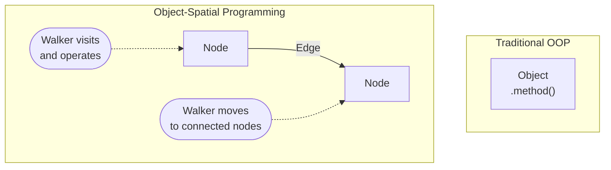

# Object-Spatial Programming

Learn Jac's unique graph-based programming paradigm with nodes, edges, and walkers.

> **Prerequisites**
>
> - Completed: [Hello World](../../quick-guide/hello-world.md)
> - Recommended: [What Makes Jac Different](../../quick-guide/what-makes-jac-different.md) (gentler introduction)
> - Time: ~45 minutes

---

## What is Object-Spatial Programming?

Traditional OOP: Objects exist in isolation. You call methods to bring data to computation.

**Object-Spatial Programming (OSP):** Objects exist in a graph with explicit relationships. You send computation (walkers) to data.



---

> **Quick Reference: Graph Operators**
>
> | Operator | Meaning | Example |
> |----------|---------|---------|
> | `++>` | Create/connect node | `root ++> Person()` |
> | `[-->]` | Query outgoing edges | `[node -->]` |
> | `[<--]` | Query incoming edges | `[node <--]` |
> | `spawn` | Start walker at node | `node spawn Walker()` |
> | `visit` | Move walker to nodes | `visit [-->]` |
> | `report` | Return data from walker | `report here` |
>
> See [Graph Operations](../../reference/language/graph-operations.md) for complete reference.

---

## Nodes: Objects in Space

Nodes are classes that can be connected in a graph.

```jac
node Person {
    has name: str;
    has age: int;

    def greet() -> str {
        return f"Hi, I'm {self.name}!";
    }
}

with entry {
    # Create nodes (just like regular objects)
    alice = Person(name="Alice", age=30);
    bob = Person(name="Bob", age=25);

    # Use them like regular objects
    print(alice.greet());  # Hi, I'm Alice!
    print(bob.age);        # 25
}
```

**Key point:** Nodes are full-featured classes with methods, inheritance, etc. The graph capability is dormant until you connect them.

---

## Connecting Nodes

Use the `++>` operator to connect nodes:

```jac
node Person {
    has name: str;
}

with entry {
    alice = Person(name="Alice");
    bob = Person(name="Bob");
    carol = Person(name="Carol");

    # Connect to root (the default starting node)
    root ++> alice;
    root ++> bob;

    # Connect alice to carol
    alice ++> carol;
}
```

This creates a graph:


---

## Edges: Named Relationships

Edges can carry data and have types:

```jac
node Person {
    has name: str;
}

edge Knows {
    has since: int;      # Year they met
    has strength: str;   # "close", "acquaintance"
}

with entry {
    alice = Person(name="Alice");
    bob = Person(name="Bob");

    # Connect with a typed edge
    alice +>: Knows(since=2020, strength="close") :+> bob;
}
```

### Edge Operators

| Operator | Meaning |
|----------|---------|
| `++>` | Connect with generic edge |
| `+>: EdgeType() :+>` | Connect with typed edge |
| `-->` | Query forward connections |
| `<--` | Query backward connections |
| `<-->` | Query both directions |

---

## Querying the Graph

Use spatial operators to navigate:

```jac
node Person {
    has name: str;
}

with entry {
    alice = Person(name="Alice");
    bob = Person(name="Bob");
    carol = Person(name="Carol");

    root ++> alice;
    alice ++> bob;
    alice ++> carol;

    # Query connections from root
    people = [root -->];  # All nodes connected to root
    print(len(people));   # 1 (alice)

    # Query from alice
    friends = [alice -->];  # [bob, carol]

    # Filter by type
    only_people = [root -->](`?Person);
}
```

### Query Syntax

```jac
node Person {
    has name: str;
}

edge Knows {
    has since: int;
}

def query_examples(node: Person, alice: Person) {
    # Basic queries
    [node -->];           # All forward connections
    [node <--];           # All backward connections
    [node <-->];          # Both directions

    # Type filtering
    [node -->](`?Person);           # Only Person nodes
    [node ->:Knows:->];             # Only via Knows edges
    [node ->:Knows:->](`?Person);   # Knows edges to Person nodes

    # Chained traversal
    [alice ->:Knows:-> ->:Knows:->];  # Friends of friends
}
```

---

## Walkers: Mobile Computation

Walkers are objects that traverse the graph and execute abilities at each node.

```jac
node Person {
    has name: str;
    has visited: bool = False;
}

walker Greeter {
    can start with `root entry {
        visit [-->];  # Visit nodes connected to root
    }

    can greet with Person entry {
        print(f"Hello, {here.name}!");
        here.visited = True;
    }
}

with entry {
    alice = Person(name="Alice");
    bob = Person(name="Bob");

    root ++> alice;
    alice ++> bob;

    # Spawn walker at root
    root spawn Greeter();
}
```

**Output:**

```
Hello, Alice!
```

Wait, why only Alice? Because the walker visits root first (via `start`), then visits Alice (via `greet`), but doesn't continue to Bob. The walker needs to be told to continue traversing.

---

## Walker Traversal with `visit`

Use `visit` to continue to connected nodes:

```jac
node Person {
    has name: str;
}

walker Greeter {
    can start with `root entry {
        visit [-->];  # Start by visiting nodes connected to root
    }

    can greet with Person entry {
        print(f"Hello, {here.name}!");
        visit [-->];  # Continue to all connected nodes
    }
}

with entry {
    alice = Person(name="Alice");
    bob = Person(name="Bob");
    carol = Person(name="Carol");

    root ++> alice;
    alice ++> bob;
    alice ++> carol;

    root spawn Greeter();
}
```

**Output:**

```
Hello, Alice!
Hello, Bob!
Hello, Carol!
```

---

## Walker Context Variables

Inside a walker ability:

| Variable | Meaning |
|----------|---------|
| `here` | The current node |
| `self` | The walker instance |
| `visitor` | Same as `self` (alias) |

```jac
node Room {
    has name: str;
}

walker Explorer {
    has rooms_visited: int = 0;

    can explore with Room entry {
        self.rooms_visited += 1;
        print(f"In {here.name}, visited {self.rooms_visited} rooms");
        visit [-->];
    }
}
```

---

## Reporting Results

Use `report` to collect results from walkers:

```jac
node Person {
    has name: str;
    has age: int;
}

walker FindAdults {
    can start with `root entry {
        visit [-->];
    }

    can check with Person entry {
        if here.age >= 18 {
            report here;  # Add to results
        }
        visit [-->];
    }
}

with entry {
    root ++> Person(name="Alice", age=30);
    root ++> Person(name="Bob", age=15);
    root ++> Person(name="Carol", age=25);

    result = root spawn FindAdults();

    print(f"Found {len(result.reports)} adults");
    for person in result.reports {
        print(f"  - {person.name}");
    }
}
```

**Output:**

```
Found 2 adults
  - Alice
  - Carol
```

---

## Entry Points

Walkers can have different entry points:

```jac
walker DataProcessor {
    has data: str;

    # Runs when spawned at root
    can start with `root entry {
        print("Starting from root");
        visit [-->];
    }

    # Runs when visiting a Person node
    can process with Person entry {
        print(f"Processing {here.name}");
        visit [-->];
    }

    # Runs when visiting any node
    can default with entry {
        print("At unknown node type");
        visit [-->];
    }
}
```

---

## Practical Example: Social Network

```jac
node User {
    has username: str;
    has bio: str = "";
}

edge Follows {
    has since: str;
}

walker FindFollowers {
    can find with User entry {
        # Find all users who follow this user
        followers = [<-:Follows:<-];
        for follower in followers {
            report follower;
        }
    }
}

walker FindMutualFollows {
    can find with User entry {
        following = [here ->:Follows:->];
        followers = [here <-:Follows:<-];

        for user in following {
            if user in followers {
                report user;  # Mutual follow!
            }
        }
    }
}

with entry {
    alice = User(username="alice");
    bob = User(username="bob");
    carol = User(username="carol");

    root ++> alice;
    root ++> bob;
    root ++> carol;

    # Alice follows Bob, Bob follows Alice (mutual)
    alice +>: Follows(since="2024") :+> bob;
    bob +>: Follows(since="2024") :+> alice;

    # Carol follows Alice
    carol +>: Follows(since="2024") :+> alice;

    # Find Alice's followers
    result = alice spawn FindFollowers();
    print("Alice's followers:");
    for user in result.reports {
        print(f"  - {user.username}");
    }

    # Find Alice's mutual follows
    result = alice spawn FindMutualFollows();
    print("Alice's mutual follows:");
    for user in result.reports {
        print(f"  - {user.username}");
    }
}
```

---

## Running as an API

The same graph code becomes a REST API:

```jac
node Todo {
    has title: str;
    has done: bool = False;
}

walker add_todo {
    has title: str;

    can create with `root entry {
        new_todo = here ++> Todo(title=self.title);
        report new_todo;
    }
}

walker list_todos {
    can list with `root entry {
        for todo in [-->](`?Todo) {
            report todo;
        }
    }
}
```

```bash
# Run as API server
jac start app.jac

# Call via HTTP
curl -X POST http://localhost:8000/walker/add_todo \
  -H "Content-Type: application/json" \
  -d '{"title": "Learn OSP"}'
```

---

## When to Use Functions vs Walkers

Jac gives you two ways to expose server logic: `def:pub` functions and `walker` types.

| | `def:pub` Functions | Walkers |
|---|---|---|
| **Best for** | Simple stateless CRUD, quick prototyping | Graph traversal, per-user data, production apps |
| **Auth** | Shared data (no user isolation) | Per-user root node (`walker:priv` enforces auth) |
| **Data access** | Direct: `[root -->]` | Traversal: `visit [-->]`, `here` |
| **API style** | Function call → HTTP endpoint | Spawn walker at node |
| **State** | Stateless | Carries state across nodes via `has` properties |

!!! tip "Rule of thumb"
    Start with `def:pub` to prototype quickly. Switch to walkers when you need authentication, per-user data isolation, or multi-step graph traversal.

The [First App Tutorial](../first-app/part1-todo-app.md) uses `def:pub` in Part 1, then refactors to walkers in [Part 3](../first-app/part3-multi-user.md) -- showing exactly when and why to make the switch.

---

## Key Takeaways

| Concept | Purpose |
|---------|---------|
| `node` | Objects that live in a graph |
| `edge` | Typed relationships between nodes |
| `walker` | Mobile computation that traverses the graph |
| `++>` | Connect nodes |
| `[-->]` | Query connections |
| `visit` | Continue walker traversal |
| `report` | Collect results from walker |
| `here` | Current node in walker |
| `spawn` | Start walker at a node |

---

## Next Steps

**Continue Learning:**

- [Testing](testing.md) - Test your nodes and walkers
- [AI Integration](../ai/quickstart.md) - Add LLM capabilities
- [First App Tutorial](../first-app/part1-todo-app.md) - Review the todo app example

**Reference:**

- [Graph Operations](../../reference/language/graph-operations.md) - Complete edge/node operator reference
- [Walker Responses](../../reference/language/walker-responses.md) - Understanding `.reports` patterns
- [Part III: OSP](../../reference/language/osp.md) - Full language reference
