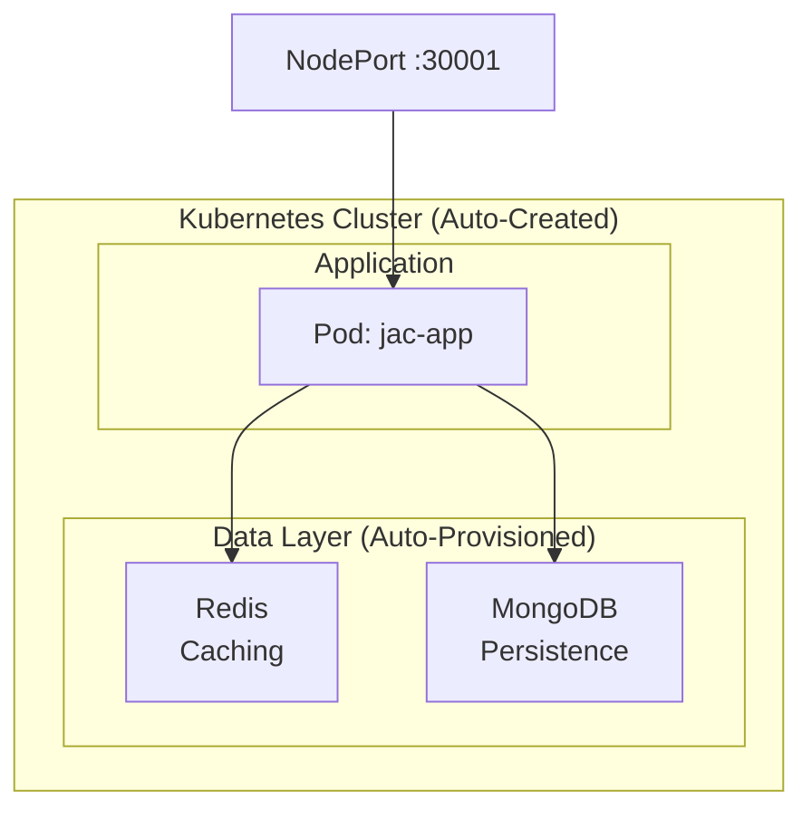

# Kubernetes Deployment

Deploy your Jac application to Kubernetes with a single command.

> **Prerequisites**
>
> - Completed: [Local API Server](local.md)
> - Kubernetes cluster running (minikube, Docker Desktop, or cloud provider)
> - `kubectl` configured
> - jac-scale installed: `pip install jac-scale`
> - Time: ~10 minutes

---

## Overview

`jac start --scale` handles everything automatically:

- Deploys your application to Kubernetes
- Auto-provisions Redis (caching) and MongoDB (persistence)
- Creates all necessary Kubernetes resources
- Exposes your application via NodePort



---

## Quick Start

### 1. Prepare Your Application

```jac
# app.jac
node Todo {
    has title: str;
    has done: bool = False;
}

walker:pub add_todo {
    has title: str;

    can create with Root entry {
        todo = here ++> Todo(title=self.title);
        report {"id": todo[0].id, "title": todo[0].title};
    }
}

walker:pub list_todos {
    can fetch with Root entry {
        todos = [-->](?:Todo);
        report [{"id": t.id, "title": t.title, "done": t.done} for t in todos];
    }
}

walker:pub health {
    can check with Root entry {
        report {"status": "healthy"};
    }
}
```

### 2. Deploy to Kubernetes

```bash
jac start app.jac --scale
```

That's it. Your application is now running on Kubernetes.

**Access your application:**

- API: http://localhost:30001
- Swagger docs: http://localhost:30001/docs

---

## Deployment Modes

### Development Mode (Default)

Deploys without building a Docker image. Fastest for iteration.

```bash
jac start app.jac --scale
```

### Production Mode

Builds a Docker image and pushes to DockerHub before deploying.

```bash
jac start app.jac --scale --build
```

**Requirements for production mode:**

Create a `.env` file with your Docker credentials:

```env
DOCKER_USERNAME=your-dockerhub-username
DOCKER_PASSWORD=your-dockerhub-password-or-token
```

---

## Configuration

Configure deployment via environment variables in `.env`:

### Application Settings

| Variable | Description | Default |
|----------|-------------|---------|
| `APP_NAME` | Name of your application | `jaseci` |
| `K8s_NAMESPACE` | Kubernetes namespace | `default` |
| `K8s_NODE_PORT` | Port for accessing the app | `30001` |

### Resource Limits

| Variable | Description | Default |
|----------|-------------|---------|
| `K8s_CPU_REQUEST` | CPU request | - |
| `K8s_CPU_LIMIT` | CPU limit | - |
| `K8s_MEMORY_REQUEST` | Memory request | - |
| `K8s_MEMORY_LIMIT` | Memory limit | - |

### Health Checks

| Variable | Description | Default |
|----------|-------------|---------|
| `K8s_READINESS_INITIAL_DELAY` | Readiness probe delay (seconds) | `10` |
| `K8s_READINESS_PERIOD` | Readiness probe interval | `20` |
| `K8s_LIVENESS_INITIAL_DELAY` | Liveness probe delay (seconds) | `10` |
| `K8s_LIVENESS_PERIOD` | Liveness probe interval | `20` |

### Database Options

| Variable | Description | Default |
|----------|-------------|---------|
| `K8s_MONGODB` | Enable MongoDB | `True` |
| `K8s_REDIS` | Enable Redis | `True` |
| `MONGODB_URI` | External MongoDB URL | Auto-provisioned |
| `REDIS_URL` | External Redis URL | Auto-provisioned |

### Authentication

| Variable | Description | Default |
|----------|-------------|---------|
| `JWT_SECRET` | JWT signing key | Auto-generated |
| `JWT_EXP_DELTA_DAYS` | Token expiration (days) | `7` |
| `SSO_GOOGLE_CLIENT_ID` | Google OAuth client ID | - |
| `SSO_GOOGLE_CLIENT_SECRET` | Google OAuth secret | - |

---

## Managing Your Deployment

### Check Status

```bash
kubectl get pods
kubectl get services
```

### View Logs

```bash
kubectl logs -l app=jaseci -f
```

### Clean Up

Remove all Kubernetes resources created by jac-scale:

```bash
jac destroy app.jac
```

This removes:

- Application deployments and pods
- Redis and MongoDB StatefulSets
- Services and persistent volumes
- ConfigMaps and secrets

---

## How It Works

When you run `jac start --scale`, the following happens automatically:

1. **Namespace Setup** - Creates or uses the specified Kubernetes namespace
2. **Database Provisioning** - Deploys Redis and MongoDB as StatefulSets with persistent storage (first run only)
3. **Application Deployment** - Creates a deployment for your Jac application
4. **Service Exposure** - Exposes the application via NodePort

Subsequent deployments only update the application - databases persist across deployments.

---

## Setting Up Kubernetes

### Option A: Docker Desktop (Easiest)

1. Install [Docker Desktop](https://www.docker.com/products/docker-desktop/)
2. Open Settings > Kubernetes
3. Check "Enable Kubernetes"
4. Click "Apply & Restart"

### Option B: Minikube

```bash
# Install minikube
brew install minikube  # macOS
# or see https://minikube.sigs.k8s.io/docs/start/

# Start cluster
minikube start

# For minikube, access via:
minikube service jaseci -n default
```

### Option C: MicroK8s (Linux)

```bash
sudo snap install microk8s --classic
microk8s enable dns storage
alias kubectl='microk8s kubectl'
```

---

## Troubleshooting

### Application not accessible

```bash
# Check pod status
kubectl get pods

# Check service
kubectl get svc

# For minikube, use tunnel
minikube service jaseci
```

### Database connection issues

```bash
# Check StatefulSets
kubectl get statefulsets

# Check persistent volumes
kubectl get pvc

# View database logs
kubectl logs -l app=mongodb
kubectl logs -l app=redis
```

### Build failures (--build mode)

- Ensure Docker daemon is running
- Verify `.env` has correct `DOCKER_USERNAME` and `DOCKER_PASSWORD`
- Check disk space for image building

### General debugging

```bash
# Describe a pod for events
kubectl describe pod <pod-name>

# Get all resources
kubectl get all

# Check events
kubectl get events --sort-by='.lastTimestamp'
```

---

## Example: Full-Stack App with Auth

```bash
# Create a new full-stack project
jac create todo --use client
cd todo

# Deploy to Kubernetes
jac start app.jac --scale
```

Access:

- Frontend: http://localhost:30001/cl/app
- Backend API: http://localhost:30001
- Swagger docs: http://localhost:30001/docs

---

## Next Steps

- [Local API Server](local.md) - Development without Kubernetes
- [Authentication](../fullstack/auth.md) - Add user authentication
- [jac-scale Reference](../../reference/plugins/jac-scale.md) - Full configuration options
