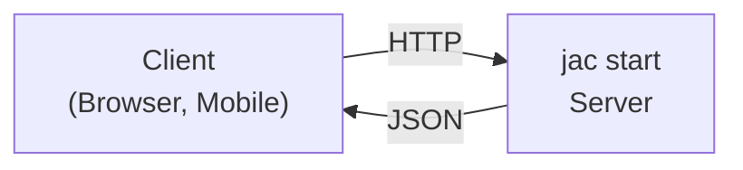

# Local API Server

Run your Jac walkers as a production-ready HTTP API server.

> **Prerequisites**
>
> - Completed: [Your First App](../../quick-guide/first-app.md)
> - Time: ~15 minutes

---

## Overview

The `jac start` command turns your walkers into REST API endpoints automatically:



---

## Quick Start

### 1. Create Your Walker

```jac
# app.jac
node Task {
    has id: int;
    has title: str;
    has done: bool = False;
}

walker:pub get_tasks {
    can fetch with `root entry {
        tasks = [-->](`?Task);
        report [{"id": t.id, "title": t.title, "done": t.done} for t in tasks];
    }
}

walker:pub add_task {
    has title: str;

    can create with `root entry {
        import random;
        task = Task(id=random.randint(1, 10000), title=self.title);
        root ++> task;
        report {"id": task.id, "title": task.title, "done": task.done};
    }
}
```

> **Note:** The `:pub` modifier makes walkers publicly accessible without authentication. Without it, API endpoints require authentication tokens.

### 2. Start the Server

```bash
jac start app.jac
```

Output:

```
INFO:     Started server process [12345]
INFO:     Waiting for application startup.
INFO:     Application startup complete.
INFO:     Uvicorn running on http://0.0.0.0:8000 (Press CTRL+C to quit)
```

### 3. Call the API

```bash
# Get all tasks
curl http://localhost:8000/get_tasks

# Add a task
curl -X POST http://localhost:8000/add_task \
  -H "Content-Type: application/json" \
  -d '{"title": "Buy groceries"}'
```

---

## Server Configuration

### Port

```bash
# Custom port
jac start app.jac --port 3000
```

### Development Mode (HMR)

Hot Module Replacement for development:

```bash
jac start app.jac --dev
```

Changes to your `.jac` files will automatically reload.

### API-Only Mode

Skip client bundling and only serve the API:

```bash
jac start app.jac --dev --no-client
```

---

## API Endpoints

### Automatic Endpoint Generation

Each public walker becomes an endpoint:

| Walker | HTTP Method | Endpoint |
|--------|-------------|----------|
| `walker:pub get_users { }` | POST | `/get_users` |
| `walker:pub create_user { }` | POST | `/create_user` |
| `walker:pub delete_user { }` | POST | `/delete_user` |

### Request Format

Walker parameters become request body:

```jac
walker:pub search_users {
    has query: str;
    has limit: int = 10;
    has page: int = 1;
}
```

```bash
curl -X POST http://localhost:8000/search_users \
  -H "Content-Type: application/json" \
  -d '{"query": "john", "limit": 20, "page": 1}'
```

### Response Format

Walker `report` values become the response:

```jac
walker:pub get_user {
    has user_id: str;

    can fetch with `root entry {
        for user in [-->](`?User) {
            if user.id == self.user_id {
                report {
                    "id": user.id,
                    "name": user.name,
                    "email": user.email
                };
                return;
            }
        }
        report {"error": "User not found"};
    }
}
```

Response:

```json
{
  "id": "123",
  "name": "Alice",
  "email": "alice@example.com"
}
```

---

## Interactive Documentation

`jac start` automatically generates Swagger/OpenAPI docs:

- **Swagger UI:** `http://localhost:8000/docs`
- **ReDoc:** `http://localhost:8000/redoc`
- **OpenAPI JSON:** `http://localhost:8000/openapi.json`

---

## Database Persistence

By default, Jac uses SQLite for persistence (you'll see "Using SQLite for persistence" when starting).

### Custom Persistence

```jac
import json;

walker save_state {
    can save with `root entry {
        data = {
            "users": [u.__dict__ for u in [-->](`?User)],
            "posts": [p.__dict__ for p in [-->](`?Post)]
        };

        with open("state.json", "w") as f {
            json.dump(data, f);
        }

        report {"saved": True};
    }
}

walker load_state {
    can load with `root entry {
        try {
            with open("state.json", "r") as f {
                data = json.load(f);
            }

            for u in data["users"] {
                root ++> User(**u);
            }

            report {"loaded": True};
        } except FileNotFoundError {
            report {"loaded": False, "reason": "No saved state"};
        }
    }
}
```

---

## Environment Variables

### Accessing Environment in Code

```jac
import os;

walker get_config {
    can fetch with `root entry {
        report {
            "database_url": os.getenv("DATABASE_URL", "sqlite:///default.db"),
            "api_key": os.getenv("API_KEY"),
            "debug": os.getenv("DEBUG", "false") == "true"
        };
    }
}
```

---

## Middleware and Hooks

### Request Logging

```jac
walker _before_request {
    has request: dict;

    can log with `root entry {
        print(f"Request: {self.request['method']} {self.request['path']}");
    }
}
```

### Authentication Middleware

```jac
walker _authenticate {
    has headers: dict;

    can check with `root entry {
        token = self.headers.get("Authorization", "");

        if not token.startswith("Bearer ") {
            report {"error": "Unauthorized", "status": 401};
            return;
        }

        # Validate token...
        report {"authenticated": True};
    }
}
```

---

## Health Checks

### Liveness Probe

```jac
walker:pub health {
    can check with `root entry {
        report {"status": "healthy"};
    }
}
```

```bash
curl http://localhost:8000/health
# {"status": "healthy"}
```

### Readiness Probe

```jac
walker:pub ready {
    can check with `root entry {
        # Check dependencies
        db_ok = check_database();
        cache_ok = check_cache();

        if db_ok and cache_ok {
            report {"status": "ready"};
        } else {
            report {"status": "not_ready", "db": db_ok, "cache": cache_ok};
        }
    }
}
```

---

## CLI Options Reference

| Option | Description | Default |
|--------|-------------|---------|
| `--port`, `-p` | Server port | 8000 |
| `--dev`, `-d` | Enable Hot Module Replacement | false |
| `--no-client`, `-n` | Skip client bundling (API only) | false |
| `--faux`, `-f` | Print API docs only (no server) | false |
| `--scale` | Deploy to Kubernetes (requires jac-scale) | false |

---

## Example: Full API

```jac
# api.jac
import from datetime { datetime }
import uuid;

node User {
    has id: str;
    has name: str;
    has email: str;
    has created_at: str;
}

# List all users
walker:pub list_users {
    can fetch with `root entry {
        users = [-->](`?User);
        report [{
            "id": u.id,
            "name": u.name,
            "email": u.email
        } for u in users];
    }
}

# Get single user
walker:pub get_user {
    has user_id: str;

    can fetch with `root entry {
        for u in [-->](`?User) {
            if u.id == self.user_id {
                report {
                    "id": u.id,
                    "name": u.name,
                    "email": u.email,
                    "created_at": u.created_at
                };
                return;
            }
        }
        report {"error": "Not found"};
    }
}

# Create user
walker:pub create_user {
    has name: str;
    has email: str;

    can create with `root entry {
        user = User(
            id=str(uuid.uuid4()),
            name=self.name,
            email=self.email,
            created_at=datetime.now().isoformat()
        );
        root ++> user;
        report {"id": user.id, "name": user.name, "email": user.email};
    }
}

# Update user
walker:pub update_user {
    has user_id: str;
    has name: str = "";
    has email: str = "";

    can update with `root entry {
        for u in [-->](`?User) {
            if u.id == self.user_id {
                if self.name { u.name = self.name; }
                if self.email { u.email = self.email; }
                report {"id": u.id, "name": u.name, "email": u.email};
                return;
            }
        }
        report {"error": "Not found"};
    }
}

# Delete user
walker:pub delete_user {
    has user_id: str;

    can remove with `root entry {
        for u in [-->](`?User) {
            if u.id == self.user_id {
                del u;
                report {"deleted": True};
                return;
            }
        }
        report {"error": "Not found"};
    }
}

# Health check
walker:pub health {
    can check with `root entry {
        report {"status": "ok", "timestamp": datetime.now().isoformat()};
    }
}
```

Run it:

```bash
jac start api.jac --port 8000 --dev
```

Test it:

```bash
# Create user
curl -X POST http://localhost:8000/create_user \
  -H "Content-Type: application/json" \
  -d '{"name": "Alice", "email": "alice@example.com"}'

# List users
curl http://localhost:8000/list_users

# Health check
curl http://localhost:8000/health
```

---

## Next Steps

- [Kubernetes Deployment](kubernetes.md) - Scale with jac-scale
- [Authentication](../fullstack/auth.md) - Add user login
