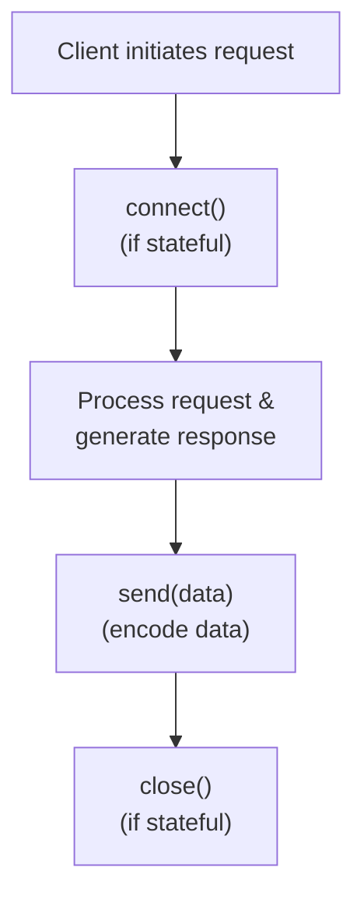

# Transport Layer Architecture

## Overview

The Transport Layer provides a protocol-agnostic abstraction for communication in the Jac API server. It decouples the business logic from the underlying transport protocol (HTTP, WebSocket, Server-Sent Events, etc.), enabling seamless switching between different communication mechanisms.

The transport layer is implemented in [jac/jaclang/runtimelib/transport.jac](../../jac/jaclang/runtimelib/transport.jac).

## Core Components

### 1. MessageType Enum

Defines the types of messages that can be sent through the transport:

```jac
enum MessageType {
    RESPONSE = "response",    # Standard response message
    EVENT = "event",          # Event notification
    CHUNK = "chunk",          # Data chunk (for streaming)
    DONE = "done",            # Stream completion signal
    ERROR = "error"           # Error message
}
```

### 2. TransportRequest

A protocol-independent request container that normalizes requests from different transport implementations:

```jac
obj TransportRequest {
    has method: str,                                    # HTTP method (GET, POST, etc.)
        path: str,                                      # Request path
        headers: dict[(str, str)] = {},                # Request headers
        body: Any = None,                              # Request body
        query_params: dict[(str, <>list[str])] = {},  # Query parameters
        metadata: dict[(str, Any)] = {};               # Custom metadata
}
```

### 3. ErrorInfo

Encapsulates error information for responses:

```jac
obj ErrorInfo {
    has code: str,          # Error code (e.g., "INVALID_REQUEST")
        message: str,       # Human-readable error message
        details: Any = None; # Additional error context
}
```

### 4. Meta

Metadata container for tracking request context:

```jac
obj Meta {
    has request_id: (str | None) = None,     # Unique request identifier
        trace_id: (str | None) = None,       # Distributed trace identifier
        timestamp: (str | None) = None,      # Request timestamp
        extra: dict[(str, Any)] = {};        # Custom metadata
}
```

### 5. TransportResponse

Transport-agnostic response container following the envelope pattern:

```jac
obj TransportResponse {
    has type: MessageType = MessageType.RESPONSE.value,  # Message type
        ok: bool = True,                                 # Success flag
        data: Any = None,                                # Response data
        error: (ErrorInfo | None) = None,               # Error info if failed
        meta: Meta = Meta();                            # Metadata
}
```

**Helper Methods:**

- `success(data, msg_type, meta)` - Creates a successful response
- `fail(code, message, details, msg_type, meta)` - Creates an error response

### 6. BaseTransport (Abstract Base)

The abstract interface all transport implementations must extend:

```jac
obj BaseTransport {
    has on_message: (Callable[(..., Any)] | None) = None,  # Message callback
        on_error: (Callable[(..., Any)] | None) = None,    # Error callback
        on_close: (Callable[(..., Any)] | None) = None;    # Close callback

    async def connect -> None;      # Establish connection
    async def send(data: Any) -> None;  # Send data
    async def close -> None;        # Close connection
}
```

## Built-in Transport Implementations

### HTTPTransport

Handles stateless HTTP request/response communication:

```jac
obj HTTPTransport(BaseTransport) {
    has handler: Any = None,
        response_data: dict[(str, Any)] = {};

    def connect -> None;        # No-op (HTTP is stateless)
    def send(data: Any) -> None;   # Store response and trigger callback
    def close -> None;          # No-op (HTTP is stateless)
}
```

**Use Case:** RESTful API endpoints, stateless request/response patterns.

## How It Works

### Message Flow

1. **Request Arrives** → Transport receives raw protocol-specific request
2. **Normalize** → Transport converts to `TransportRequest`
3. **Process** → Business logic processes the request
4. **Create Response** → Logic creates `TransportResponse`
5. **Send** → Transport sends response via `send()` method
6. **Protocol Encoding** → Transport encodes response for its protocol

### Connection Lifecycle



## Adding New Transport Types

To add support for a new transport protocol, follow these steps:

### Step 1: Create the Transport Class

Extend `BaseTransport` and implement the three required methods:

```jac
obj NewProtocolTransport(BaseTransport) {
    has connection: Any = None;

    async def connect -> None {
        # Initialize connection to the new protocol
        # Example: establish gRPC channel, AMQP connection, etc.
    }

    async def send(data: Any) -> None {
        # Serialize and send data through the protocol
        # Example: marshal to protobuf, AMQP serialize, etc.
        # Don't forget to trigger: self.on_message(response)
    }

    async def close -> None {
        # Cleanup and close the connection
        # Example: gracefully close channel, disconnect, etc.
    }
}
```

### Step 2: Implement Protocol-Specific Serialization

Handle data serialization/deserialization for your protocol:

```jac
obj NewProtocolTransport(BaseTransport) {
    # ... existing code ...

    private def serialize(data: Any) -> bytes {
        # Convert TransportResponse to protocol format
        # Example: JSON encoding, protobuf, AMQP message, etc.
    }

    private def deserialize(raw_data: bytes) -> TransportRequest {
        # Convert raw protocol data to TransportRequest
    }
}
```

### Step 3: Add Callback Integration

Ensure callbacks are properly triggered:

```jac
async def send(data: Any) -> None {
    try {
        encoded = self.serialize(data);
        # Send through protocol
        if self.on_message:
            self.on_message(data);
    } except Exception as e {
        if self.on_error:
            self.on_error(e);
    }
}
```

### Step 4: Example - gRPC Transport

Here's a concrete example:

```jac
obj gRPCTransport(BaseTransport) {
    has stub: Any = None,
        context: Any = None;

    async def connect -> None {
        # Create gRPC channel and stub
        self.stub = initialize_grpc_stub();
    }

    async def send(data: Any) -> None {
        # Serialize to protobuf
        grpc_message = self.to_protobuf(data);
        # Send via gRPC
        await self.stub.SendMessage(grpc_message);
        if self.on_message:
            self.on_message(data);
    }

    async def close -> None {
        await self.stub.close();
    }

    private def to_protobuf(data: Any) -> Any {
        # Convert TransportResponse to protobuf message
    }
}
```

### Step 5: Register and Use

Once implemented, register your transport with the API server:

```jac
# In your API handler
let transport: BaseTransport = gRPCTransport();
await transport.connect();

# Use the same interface regardless of protocol
response = TransportResponse.success(data=result);
await transport.send(response);
await transport.close();
```
